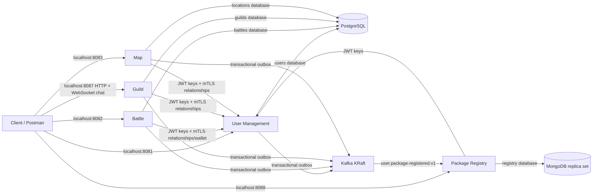
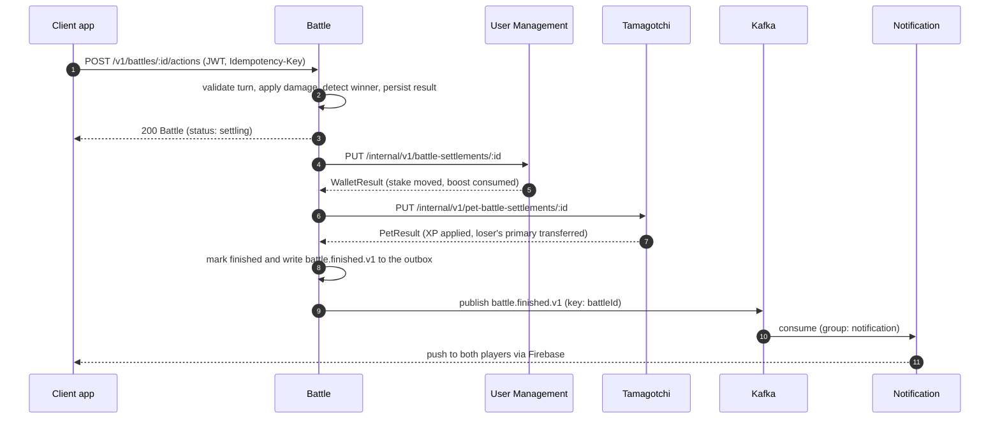

# Deployment architecture

## Running Lab 1 environment

Docker Compose runs three Go services, two TypeScript services, one PostgreSQL server, one single-node MongoDB replica set and one single-node Kafka KRaft broker. Clients call the services directly. Each API process also runs its background workers; no extra worker containers are needed.

| Container | Responsibility | Storage |
| --- | --- | --- |
| User Management | Accounts, relationships, enrollments, wallets and rewards | `users`, owned by role `users` |
| Battle | Challenges, turns, deadlines, outcomes and settlement progress | `battles`, owned by role `battles` |
| Map | Each player's latest location, encounters between strangers and the nearby view | `locations`, owned by role `locations` |
| Guild | Guilds, invitations, membership, roles and WebSocket chat | `guilds`, owned by role `guilds` |
| Package Registry | Packages, immutable configurations, combat rules, monsters, raid schedules and the enrollment projection | MongoDB `registry`, user `registry` |
| PostgreSQL | Hosts isolated databases; services never read/write the other database | `postgres-data` named volume |
| MongoDB | Single-node replica set so the Registry can use multi-document transactions | `mongo-data`, `mongo-config` named volumes |
| Kafka | One topic per event type; Package Registry consumes enrollments (group `package-registry`) | `kafka-data` named volume |

### Technology and networking

The APIs use Go 1.26, `net/http`, pgx, RS256 JWTs and franz-go. JSON payloads are validated against copies of the common schemas. PostgreSQL owns durability; Kafka delivers events asynchronously. Docker Compose provides service discovery (`postgres`, `kafka`, `user-management`, `battle`). Only API ports are published, bound to localhost. PostgreSQL and Kafka have no host ports. Map has no internal routes; its certificate is only a client certificate for User Management's relationship lookups.

Guild and Package Registry use Node.js 24, TypeScript, Fastify, Ajv (against copies of the common schemas), jose and kafkajs; Guild stores data with `pg` and Registry with the MongoDB driver. Their internal APIs listen on port 8443 with the same mutual-TLS rules; Package Registry reads User Management's Snappy-compressed events through a registered Snappy codec.

This is a local teaching deployment, not a cloud or multi-PC cluster. Kafka has one broker and replication factor one; a volume survives container recreation but not loss of the host disk. Kafka uses distinct SASL credentials and producer topic ACLs; its private controller listener is unauthenticated. Internal service calls use TLS 1.3 with verified service certificates and caller allowlists. Public local HTTP, PostgreSQL and Kafka use plaintext on the development network; use encrypted transport when deploying across hosts.

Compose is sufficient for the current eight containers. Kubernetes, Swarm, autoscaling, an API gateway and teammates' services are deferred. Running on four PCs would require a separate cluster/network/storage design; sharing a Compose file does not form a cluster.

### Ownership and consistency

Each service stores JSONB aggregates in its own database, with indexed owners and bounded cursor pagination. Short transactions serialize each service's mutations using a database advisory lock. This makes multi-record invariants simple for the lab; throughput is limited and should be revisited before scaling. Migrations run explicitly, separately from database/role provisioning.

Business changes and outbox events commit atomically. A worker deletes an outbox row only after Kafka acknowledges it. Failed publication retries from persisted rows; a crash after broker acknowledgement can repeat an event with the same ID. Future consumers must deduplicate it. No event consumers or dead-letter processors are required by these two publisher-only services.

Battle stores each reservation, compensation and settlement step. Remote calls happen outside database transactions; stable activity IDs make crash recovery safe. `paired` mode uses real User Management JWTs, relationships and wallets. Package Registry and Tamagotchi are explicit fixtures. `live` mode uses their real HTTP contracts and never falls back to fixtures.

Map keeps plain rows instead of JSONB aggregates: one per player location and one per pair of strangers. A conditional upsert drops stale reports without a service-wide advisory lock, and a report updates its encounter pairs in a fixed order. An encounter starts, with its `map.encountered.v1` event, only when two strangers come within 6 meters after being apart. The lab runs Map in `live` mode, which reads relationships and profiles from User Management and never falls back to fixtures; `mock` mode replaces only those lookups with built-in fixtures (Alice and Bob are friends) for local development.

### Fixtures and limitations

Seeding creates Alice and Bob (`alice@demo.invalid`, `bob@demo.invalid`) with `SEED_PASSWORD`. Each starts at zero, then receives 20 coins from one recorded fixture raid; repeated seeding does not credit them again. New registrations always start at zero. Package fixture: `11111111-1111-4111-8111-111111111111`.

Battle's pet fixtures exist only for Alice/Bob. Pet XP and capture persist in Battle's fixture records; a captured pet invalidates its original owner's loadout. Other registered players need real Tamagotchi provisioning to battle. Use a separate disposable Compose project for fresh demonstrations.

Guild seeds the *Night Owls* guild (`22222222-2222-4222-8222-222222222222`: Alice leader, Bob officer, two chat messages). Package Registry seeds the fixture package above as active with configuration 1 and Bob as moderator, the monster `33333333-3333-4333-8333-333333333333` and a raid schedule for Night Owls one hour after seeding; its enrollment projection fills from User Management's real events. User Management tokens carry no admin role yet, so the Registry treats the users listed in `REGISTRY_ADMIN_USER_IDS` as global admins (empty by default: set it in your local `.env`, for example to Alice's ID, to use the admin routes); a `roles: ["admin"]` claim also works once issued. Registry raid commands go to a Monster Raid fixture until that service is deployed. Guild chat broadcasts reach sockets on its single instance only.

Map seeds Alice's and Bob's locations about 3 meters apart, recorded at seeding time. They go stale two minutes later: friends and enemies stay listed, while strangers appear only near a fresh report. Marking a friend as an enemy in User Management ends the friendship, so the Map collection and `scripts/smoke_map.py` first make Alice and Bob strangers and finish by restoring their seeded friendship.

Setup creates a one-year development CA and one certificate per service (CN and DNS name = service name) in ignored `.secrets/tls`, using OpenSSL inside the already-required PostgreSQL image; the CA key never leaves that container. Each container receives only its own private key and the CA certificate. Internal HTTPS uses port 8443 without a host mapping. To add a service or before expiry, setup replaces the full bundle; restart every service afterwards. Use your deployment's certificate authority for live services.

### Extending the environment

1. Add a database/role/password-variable entry to `deployment/databases.json` (PostgreSQL) or extend `deployment/mongo-init.js` (MongoDB); add the password placeholder to `.env.example` and `SECRET_KEYS` in `scripts/lab.py`, and the service name to `TLS_SERVICES`. Setup appends missing variables to existing `.env` files.
2. Run `python3 scripts/lab.py provision` against the existing PostgreSQL volume. This creates missing roles/databases without deleting or resetting existing data or passwords.
3. Add the teammate's public, versioned image to Compose, its database credentials, health check and required networking. Never add private-source `build:` paths to CPR deployment.
4. Run that service's migrations and optional empty-database seed, then add its Kafka SASL user (Compose `KAFKA_LISTENER_NAME_CLIENT_PLAIN_SASL_JAAS_CONFIG`), topics and consumer groups in `scripts/lab.py`.

Changing an existing password in `.env` does not rotate an existing database role: perform an explicit coordinated rotation. Never delete volumes to apply a schema or provisioning change.

## Future full-system architecture

The following agreed design includes services and infrastructure not deployed by Lab 1. It is retained as the team's target architecture; proposed endpoints remain in the common contract.

### System overview

Client apps reach every service through a single **API Gateway**, and each service owns its database and credentials: MongoDB for Package Registry, PostgreSQL for the other seven services. Services never share a database. Neither of these is drawn as a separate box per service in the diagram above but both apply to all eight backend services. The one exception on the gateway side is Guild's chat: client apps hold a direct WebSocket connection to Guild Service for real-time messages, shown as the green line bypassing the gateway. Firebase Cloud Messaging is also reached directly by client apps for push delivery, independent of the gateway.

Black arrows are direct HTTP calls between services. Orange arrows are events flowing through Kafka.

### Service dependencies

The service dependencies are the black arrows above — direct HTTP calls, not routed through the API Gateway. Authentication calls (every service verifies JWTs with User Management's public keys) aren't drawn, for the same readability reason.

- **Monster Raid → Package Registry** — raid configuration and lifecycle, plus reward rule lookups.
- **Tamagotchi → Package Registry** — starter pet definitions, care and growth rules.
- **Battle → Package Registry** — package combat rules, plus reward rule lookups.
- **Battle → Tamagotchi** — pet properties, XP and capture at battle settlement.
- **Monster Raid → Tamagotchi** — primary pet properties and XP for participating members.
- **Tamagotchi → User Management** — enrollment checks and local reward settlement.
- **User Management → Tamagotchi** — starter-pet provisioning recovery, a fallback if the enrollment event was missed.
- **Monster Raid → User Management** — currency reward settlement.
- **Battle → User Management** — currency and boost settlement.
- **Map → User Management** — friends/enemies lookups, used to decide what an encounter should trigger.
- **Guild → User Management** — identity and relationship lookups for membership and invite eligibility.
- **Monster Raid → Guild** — membership and permission checks before a member can join a raid.

### Event flow

The event flow is represented with orange arrows above. Anything that doesn't have to happen before a response is sent travels as an event through Kafka instead of a direct call.

User Management publishes `user.package-registered.v1` on enrollment; Package Registry and Tamagotchi consume it independently: Registry updates its enrollment projection, while Tamagotchi provisions the starter pet. Six services — User Management, Map, Battle, Tamagotchi, Guild and Monster Raid — publish their own domain events (friend requests, encounters, battle results, pet use/capture, guild invites, raid results) onto one Kafka topic per event type, consumed by Notification; Notification turns every one of those into a push message and hands it to Firebase Cloud Messaging, which delivers it straight to the client app.

### Example: finishing a battle

The player's request is answered as soon as the result is stored; settlement with the data owners and the notification happen afterwards.

### Decisions to confirm

The brief leaves some boundaries open. These are our choices; they can change after discussion with the professor.

| Question | Our choice |
| --- | --- |
| The brief tells Guild to use "Registry" for identity and relationships, but User Management owns those. | Guild asks User Management. |
| Both User Management and Package Registry record user-package enrollments. | User Management is authoritative; Registry keeps a read-only projection fed by events. |
| Who creates battle challenges and matches? | Battle owns challenges, acceptance and match creation. |
| Local currency rules differ per package. | User Management stores balances per user and package; Registry stores the rules. |
| Losing a battle transfers the loser's primary pet. | Tamagotchi transfers the existing record; the winner keeps its primary and gains a secondary; the loser must pick a new primary. |
| Proximity threshold is written as "6(?)" meters. | 6 meters, locations fresh for 120 seconds. |

## Services

Each service is the only writer of its data. Other services ask the owner through its API; a reference to a user, pet, package or guild points at the existing record and never creates a copy.

### 1. User Management

- **Owns:** accounts, credentials and roles; friend requests, friendships and enemy marks; which packages a user is enrolled in; global and local currency balances; battle boosts and their holds.
- **Does:** issues JWTs, answers "who is this user", "are they friends", "can they afford this stake"; applies currency results reported by Battle and Monster Raid.
- **Not here:** pets (Tamagotchi), guild membership (Guild), package definitions (Package Registry).

### 2. Battle

- **Owns:** challenges, accepted matches, chosen pets and boosts, frozen combat inputs, turn and HP state, the outcome and settlement progress.
- **Does:** computes damage from levels, type advantage, boosts and package care bonuses; decides winner rewards and the primary/secondary XP split; asks User Management and Tamagotchi to apply them.
- **Not here:** currency balances or persistent pet records (never edited directly); cooperative fights (Monster Raid).

### 3. Tamagotchi

- **Owns:** every pet: identity, origin package, owner, combat type, level, XP, sprites and package-specific care statistics; primary and secondary assignments; pet reservations for battles and raids.
- **Does:** creates the starter pet on enrollment, validates care actions against the package's pinned rules, applies XP and ownership transfers after battles and raids.
- **Not here:** a battle's temporary HP (Battle); the definition of a statistic (Package Registry).

### 4. Notification

- **Owns:** push device registrations and notification records.
- **Does:** consumes events (friend request, encounter, battle request or result, pet used or captured, guild invitation, raid start or result), decides who receives what, and delivers it through Firebase.
- **Not here:** guild chat (Guild); any game decision.

### 5. Map

- **Owns:** each user's latest location and timestamp; encounter state.
- **Does:** ignores stale updates, keeps friends and enemies visible, detects strangers within 6 meters and publishes an encounter event that may lead to a friend request or a battle.
- **Not here:** challenges (Battle) and alerts (Notification).

### 6. Monster Raid

- **Owns:** active raid instances: monster HP, participants, damage per participant, timer and status.
- **Does:** starts raids from Registry schedules, checks guild eligibility and reserves primary pets, processes clicker-style attacks with a one-second cooldown, and requests rewards from User Management and Tamagotchi on victory.
- **Not here:** monster and schedule definitions (Package Registry); membership (Guild).

### 7. Guild

- **Owns:** guilds, invitations, members and roles (leader, officer, member); chat messages with a per-guild sequence.
- **Does:** enforces membership and permission rules, runs the guild chat over WebSockets, and tells Monster Raid who is eligible.
- **Not here:** friendships and enemies (User Management); the raid itself (Monster Raid).

### 8. Package Registry

- **Owns:** packages and their moderators; immutable package configurations (starter pets, statistics, care actions, combat bonus thresholds); global combat rules; monster definitions; raid schedules.
- **Does:** lets admins register packages and configure monsters and raids, lets moderators publish package rules, keeps a projection of enrollments, and tells Monster Raid when a raid starts or is cancelled.
- **Not here:** a pet's current statistic values (Tamagotchi); live raid state (Monster Raid).

## Future technologies and communication patterns

The team works in **Go and TypeScript**. Each person implements both of their services in one language.

| Service | Owner | Language and framework | Storage | Communication |
| --- | --- | --- | --- | --- |
| User Management | Alexei | Go, `net/http` | PostgreSQL `users` | HTTP/JSON; publishes enrollment and friend events |
| Battle | Alexei | Go, `net/http` | PostgreSQL `battles` | HTTP/JSON with client polling of battle state; publishes battle events |
| Tamagotchi | Artur | TypeScript, Fastify | PostgreSQL `pets` (JSONB for package statistics) | HTTP/JSON; consumes enrollment events; publishes pet events |
| Notification | Artur | TypeScript, Fastify | PostgreSQL `notifications` | HTTP/JSON for devices; consumes Kafka events; Firebase push |
| Map | Alexandru | Go, `net/http` | PostgreSQL `locations` | HTTP/JSON; publishes encounter events |
| Monster Raid | Alexandru | Go, `net/http` | PostgreSQL `raids` | HTTP/JSON with client polling of raid state; publishes raid events |
| Guild | Nicolae | TypeScript, Fastify | PostgreSQL `guilds` | HTTP/JSON; WebSocket chat; publishes invitation events |
| Package Registry | Nicolae | TypeScript, Fastify | MongoDB `registry` (versioned configuration documents) | HTTP/JSON; consumes enrollment events |

**Why two languages, and these two.** Go's standard library gives small, fast binaries with built-in concurrency, which fits the request-heavy, timer-driven services (settlement, combat, location updates, raid attacks). TypeScript with Fastify gives schema-validated routes, JSON-native handling of package-specific statistics and easy WebSocket support, which fits pets, notifications, chat and configuration. One language per person avoids context switching. The cost is keeping validation and serialization equivalent in both stacks; the language-neutral contract below is the shared reference.

**PostgreSQL for seven services.** Balances, ownership, holds and combat state need local transactions; PostgreSQL gives them, and JSONB stores each package's differently named statistics without a shared schema. Separate databases make ownership explicit at the cost of cross-service consistency work, handled with the outbox and settlement flows below. For the lab, one PostgreSQL server can host the seven relational databases with separate credentials.

**MongoDB for Package Registry.** Store each immutable configuration version as a document containing starter pets, statistics and care actions. Keep packages, enrollments, monsters and schedules in separate collections, with unique indexes for identity and version pairs. Publish configurations and advance their current-version pointer atomically; persist enrollment projections and processed-event inbox entries in one transaction before committing Kafka offsets. Run MongoDB as a replica set to support these transactions. See the [Registry storage design](services/package-registry/README.md#storage-design).

**HTTP/JSON for requests.** Synchronous calls handle decisions the caller must know immediately, such as reserving pets or checking eligibility. JSON is inspectable from both languages and from any client app. Calls time out after two seconds and unfinished work stays visible for retry. Clients poll battle and raid resources; guild chat uses WebSockets because it needs continuous delivery, and therefore reconnect and history replay.

**Kafka for events.** Events are an append-only log: a consumer that was down (Notification, Registry) catches up from its last offset, and a new projection can replay history. Partitioning by `aggregateId` keeps events for one battle, raid or request in order. The cost is a heavier broker to run and no per-message routing; the lab uses a single-node Kafka in Docker and one topic per event type.

**Firebase Cloud Messaging** is the push provider required by the brief. A push carries only `eventId`, `type` and `targetId`; the client fetches the authoritative state after opening it. Firebase needs a project, a service-account key kept out of Git, and a client that produces device tokens.
