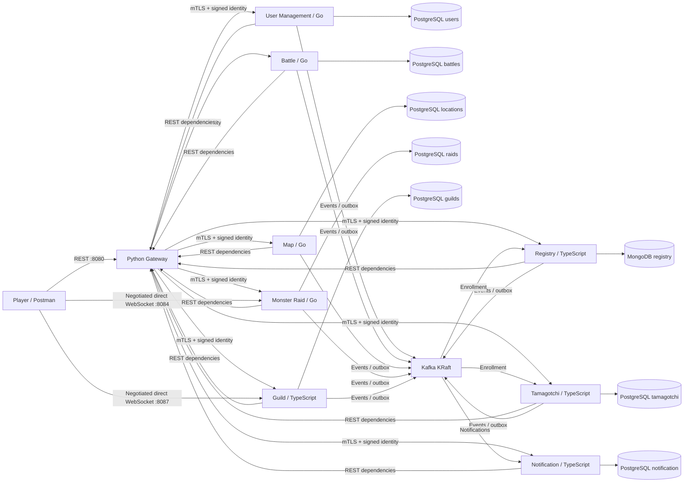
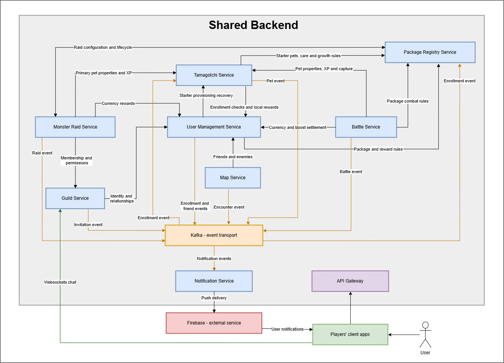
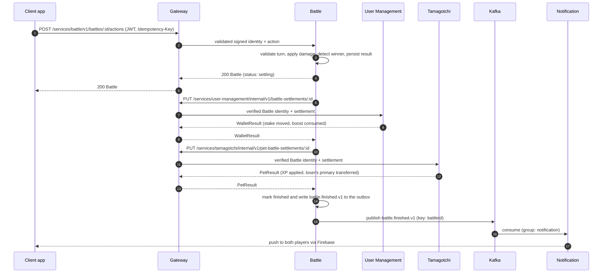

# Deployment architecture

## Running environment

One `compose.yaml` runs the existing project: Python Gateway, four Go services, four TypeScript services, PostgreSQL, MongoDB and Kafka. API processes run their own workers. No new database or worker container is needed for Gateway. The existing Compose project name is retained so upgrades use the same volumes.

```mermaid
flowchart LR
  P[Player / Postman] -->|REST :8080| GW[Python Gateway]
  GW -->|mTLS + signed identity| U[User Management / Go] & B[Battle / Go] & MP[Map / Go] & MR[Monster Raid / Go]
  GW -->|mTLS + signed identity| G[Guild / TypeScript] & R[Registry / TypeScript] & T[Tamagotchi / TypeScript] & N[Notification / TypeScript]
  U & B & MP & MR & G & R & T & N -->|REST dependencies| GW
  P -->|Negotiated direct WebSocket :8087| G
  P -->|Negotiated direct WebSocket :8084| MR
  U --> Users[(PostgreSQL users)]
  B --> Battles[(PostgreSQL battles)]
  MP --> Locations[(PostgreSQL locations)]
  MR --> Raids[(PostgreSQL raids)]
  G --> Guilds[(PostgreSQL guilds)]
  R --> Registry[(MongoDB registry)]
  T --> Pets[(PostgreSQL tamagotchi)]
  N --> Notifications[(PostgreSQL notification)]
  U & B & MP & MR & G & R & T -->|Events / outbox| K[Kafka KRaft]
  K -->|Enrollment| R & T
  K -->|Notifications| N
```

The diagram shows the required deployment. Gateway routing is configured for every service, but the four TypeScript images still need compatible implementations; see Integration checks below. There are no direct service-to-service REST shortcuts.

| Container | Responsibility | Storage |
| --- | --- | --- |
| Gateway | REST routing, JWT verification, signed identities, deadlines and WebSocket negotiation | None |
| User Management | Accounts, relationships, enrollments, wallets and rewards | PostgreSQL `users` |
| Battle | Challenges, turns, deadlines, outcomes and settlement | PostgreSQL `battles` |
| Map | Locations and nearby encounters | PostgreSQL `locations` |
| Monster Raid | Raids, participants, attacks and rewards | PostgreSQL `raids` |
| Guild | Membership, invitations, roles and chat | PostgreSQL `guilds` |
| Package Registry | Packages, configurations, rules, monsters and schedules | MongoDB `registry` |
| Tamagotchi | Pets, care, XP, reservations and ownership | PostgreSQL `tamagotchi` |
| Notification | Devices and notifications | PostgreSQL `notification` |
| PostgreSQL | Separate databases and credentials for each owner | `postgres-data` |
| MongoDB | Single-node replica set for Registry transactions | `mongo-data`, `mongo-config` |
| Kafka | Events with service SASL credentials and topic ACLs | `kafka-data` |

## Networking

Gateway exposes REST on `localhost:8080`. Containers use `https://gateway:8443/services/{destination}` with their own certificates. Gateway forwards requests over mTLS with signed caller identities and never forwards Authorization. Service handlers still check ownership and permissions.

Use one base URL per REST destination, for both `/v1` and `/internal/v1` routes. Compose uses `REGISTRY_URL`, `TAMAGOTCHI_URL`, `USER_MANAGEMENT_URL`, `GUILD_URL` and `MONSTER_RAID_URL`. Derive JWKS from the User Management base plus `/.well-known/jwks.json`; Gateway derives it from its User Management upstream. Other service owners must adopt these names and key discovery before using the updated Compose.

Only Guild and Monster Raid publish additional ports, for direct sockets negotiated through Gateway. Their socket listeners must reject direct business REST. PostgreSQL, MongoDB, Kafka and internal mTLS ports stay private.

Setup creates development certificates in ignored `.secrets/tls`. Each service receives its own key, the CA and Gateway's public certificate. Replace expired bundles together and restart all services. Compose fits the single-PC presentation; the databases and broker are single-node development infrastructure.

## Ownership and durability

Only the owning service writes its database. Provisioning creates missing databases/roles without deleting data; migrations belong to each service. Seeds populate empty databases and preserve existing records. Named volumes survive container recreation.

Business changes and outbox events commit together. Kafka outages retain pending rows; publication retries with stable event IDs. Consumers deduplicate repeats. Battle persists deadlines and reservation/settlement progress, and retries remote work outside transactions using stable activity IDs.

## Integration checks

The lab is not complete until all published images pass the shared deployment tests. Configuration flags do not implement missing authentication or request limits.

| Area | Current finding / remaining work |
| --- | --- |
| Gateway | Python implementation, JWT verification, header stripping, signed identities, task limits and both socket negotiations have automated tests. |
| User Management | New batch public-profile handler fixes Map's missing dependency; merge and publish the service fix. Strict Gateway authentication remains enabled. |
| Battle, Map, Monster Raid | Gateway transport and request limits implemented; complete live workflows still depend on compatible TypeScript destinations. |
| Guild, Package Registry | `latest` tags were missing on 7 October. Owners must publish Gateway-compatible releases, including limits and merge-triggered CI. Guild must support the membership read used in socket negotiation. |
| Tamagotchi, Notification | Newly pulled `latest` images still lack Gateway identity and task-limit configuration. Tamagotchi's published configuration only supports mock/paired dependencies. Owners must complete live integration. |
| Shared runtime | All REST URLs now use Gateway; readiness checks every destination. `up` pulls latest before migrations and stops if an image is unavailable. |

Run `scripts/check_lab2.py` for configuration checks, `scripts/smoke_gateway.py` for authentication and Battle-to-User-Management routing, then the service smoke scripts and `scripts/smoke_live.py` for real workflows. Full-team success cannot be claimed from the isolated service tests.

Do not create fake production pets, forward bearer tokens or bypass Gateway to hide integration failures. Notification's external Firebase delivery remains an explicit local mock. Fresh accounts start with zero currency; Alice/Bob use local `SEED_PASSWORD`. Existing records are preserved.

## Extending the deployment

1. Add the owning database/role/password entry to `deployment/databases.json` or MongoDB provisioning. Add secret placeholders and generation keys to `.env.example`/`scripts/lab.py`.
2. Add the public image, private database credentials and healthcheck to the existing `compose.yaml`. Add its certificate to setup and mount only the required keys.
3. Follow [Gateway transport contract](contracts/gateway.md), update the route catalog from OpenAPI, and configure Kafka topics/ACLs for its events.
4. Run `setup`, `provision`, migrations and seeds on the existing volumes. Publish merged service commits with versioned and latest tags, then update Gateway routing and submodule pointers through a common PR.

## Future full-system architecture

The following agreed design is the team's target architecture. The running deployment is described above; remaining integrations are listed under Integration checks.

### System overview

Client apps reach every service through a single **API Gateway**, and each service owns its database and credentials: MongoDB for Package Registry, PostgreSQL for the other seven services. Services never share a database. Neither of these is drawn as a separate box per service in the diagram above but both apply to all eight backend services. Direct sockets are used for Guild chat and Monster Raid live updates. For Guild chat, client apps hold a direct WebSocket connection to Guild Service for real-time messages, shown as the green line bypassing the gateway. Firebase Cloud Messaging is also reached directly by client apps for push delivery, independent of the gateway.

Black arrows show logical HTTP dependencies between services; Gateway carries their REST traffic. Orange arrows are events flowing through Kafka.

### Service dependencies

The diagram shows logical owner-to-owner dependencies. Their REST calls pass through Gateway as shown above. Gateway verifies player JWTs using User Management's public keys; services verify the forwarded identity and enforce permissions. Authentication discovery is omitted from the diagram for readability.

- **Monster Raid → Package Registry** — raid configuration and lifecycle, plus reward rule lookups.
- **Tamagotchi → Package Registry** — starter pet definitions, care and growth rules.
- **Battle → Package Registry** — package combat rules, plus reward rule lookups.
- **Battle → Tamagotchi** — pet properties, XP and capture at battle settlement.
- **Monster Raid → Tamagotchi** — primary pet properties and XP for participating members.
- **Tamagotchi → User Management** — enrollment checks and local reward settlement.
- **User Management → Tamagotchi** — starter-pet provisioning recovery, a fallback if the enrollment event was missed.
- **Monster Raid → User Management** — currency reward settlement.
- **Battle → User Management** — currency and boost settlement.
- **Map → User Management** — friends/enemies lookups, used to decide what an encounter should trigger, and usernames for map entries.
- **Guild → User Management** — identity and relationship lookups for membership and invite eligibility.
- **Monster Raid → Guild** — membership and permission checks before a member can join a raid.

### Event flow

The event flow is represented with orange arrows above. Anything that doesn't have to happen before a response is sent travels as an event through Kafka instead of a direct call.

User Management publishes `user.package-registered.v1` on enrollment; Package Registry and Tamagotchi consume it independently: Registry updates its enrollment projection, while Tamagotchi provisions the starter pet. Six services — User Management, Map, Battle, Tamagotchi, Guild and Monster Raid — publish their own domain events (friend requests, encounters, battle results, pet use/capture, guild invites, raid results) onto one Kafka topic per event type, consumed by Notification; Notification turns every one of those into a push message and hands it to Firebase Cloud Messaging, which delivers it straight to the client app.

### Example: finishing a battle

The player's request is answered as soon as the result is stored; settlement with the data owners and the notification happen afterwards.

```mermaid
sequenceDiagram
    autonumber
    participant C as Client app
    participant GW as Gateway
    participant B as Battle
    participant UM as User Management
    participant T as Tamagotchi
    participant K as Kafka
    participant N as Notification
    C->>GW: POST /services/battle/v1/battles/:id/actions (JWT, Idempotency-Key)
    GW->>B: validated signed identity + action
    B->>B: validate turn, apply damage, detect winner, persist result
    B-->>GW: 200 Battle (status: settling)
    GW-->>C: 200 Battle
    B->>GW: PUT /services/user-management/internal/v1/battle-settlements/:id
    GW->>UM: verified Battle identity + settlement
    UM-->>GW: WalletResult (stake moved, boost consumed)
    GW-->>B: WalletResult
    B->>GW: PUT /services/tamagotchi/internal/v1/pet-battle-settlements/:id
    GW->>T: verified Battle identity + settlement
    T-->>GW: PetResult (XP applied, loser's primary transferred)
    GW-->>B: PetResult
    B->>B: mark finished and write battle.finished.v1 to the outbox
    B->>K: publish battle.finished.v1 (key: battleId)
    K->>N: consume (group: notification)
    N-->>C: push to both players via Firebase
```

### Decisions to confirm

The brief leaves some boundaries open. These are our choices; they can change after discussion with the professor.

| Question | Our choice |
| --- | --- |
| The brief tells Guild to use "Registry" for identity and relationships, but User Management owns those. | Guild asks User Management. |
| Both User Management and Package Registry record user-package enrollments. | User Management is authoritative; Registry keeps a read-only projection fed by events. |
| Who creates battle challenges and matches? | Battle owns challenges, acceptance and match creation. |
| Local currency rules differ per package. | User Management stores balances per user and package; Registry stores the rules. |
| Losing a battle transfers the loser's primary pet. | Tamagotchi transfers the existing record; the winner keeps its primary and gains a secondary; the loser must pick a new primary. |
| Proximity threshold is written as "6(?)" meters. | 6 meters, locations fresh for 120 seconds. |

## Services

Each service is the only writer of its data. Other services ask the owner through its API; a reference to a user, pet, package or guild points at the existing record and never creates a copy.

### 1. User Management

- **Owns:** accounts, credentials and roles; friend requests, friendships and enemy marks; which packages a user is enrolled in; global and local currency balances; battle boosts and their holds.
- **Does:** issues JWTs, answers "who is this user", "are they friends", "can they afford this stake"; applies currency results reported by Battle and Monster Raid.
- **Not here:** pets (Tamagotchi), guild membership (Guild), package definitions (Package Registry).

### 2. Battle

- **Owns:** challenges, accepted matches, chosen pets and boosts, frozen combat inputs, turn and HP state, the outcome and settlement progress.
- **Does:** computes damage from levels, type advantage, boosts and package care bonuses; decides winner rewards and the primary/secondary XP split; asks User Management and Tamagotchi to apply them.
- **Not here:** currency balances or persistent pet records (never edited directly); cooperative fights (Monster Raid).

### 3. Tamagotchi

- **Owns:** every pet: identity, origin package, owner, combat type, level, XP, sprites and package-specific care statistics; primary and secondary assignments; pet reservations for battles and raids.
- **Does:** creates the starter pet on enrollment, validates care actions against the package's pinned rules, applies XP and ownership transfers after battles and raids.
- **Not here:** a battle's temporary HP (Battle); the definition of a statistic (Package Registry).

### 4. Notification

- **Owns:** push device registrations and notification records.
- **Does:** consumes events (friend request, encounter, battle request or result, pet used or captured, guild invitation, raid start or result), decides who receives what, and delivers it through Firebase.
- **Not here:** guild chat (Guild); any game decision.

### 5. Map

- **Owns:** each user's latest location and timestamp; encounter state.
- **Does:** ignores stale updates, lets players read or clear their own location, keeps friends and enemies visible, detects strangers within 6 meters and publishes an encounter event that may lead to a friend request or a battle.
- **Not here:** challenges (Battle) and alerts (Notification).

### 6. Monster Raid

- **Owns:** active raid instances: monster HP, participants, damage per participant, timer and status.
- **Does:** starts raids from Registry schedules, checks guild eligibility and reserves primary pets, processes clicker-style attacks with a one-second cooldown, and requests rewards from User Management and Tamagotchi on victory.
- **Not here:** monster and schedule definitions (Package Registry); membership (Guild).

### 7. Guild

- **Owns:** guilds, invitations, members and roles (leader, officer, member); chat messages with a per-guild sequence.
- **Does:** enforces membership and permission rules, runs the guild chat over WebSockets, and tells Monster Raid who is eligible.
- **Not here:** friendships and enemies (User Management); the raid itself (Monster Raid).

### 8. Package Registry

- **Owns:** packages and their moderators; immutable package configurations (starter pets, statistics, care actions, combat bonus thresholds); global combat rules; monster definitions; raid schedules.
- **Does:** lets admins register packages and configure monsters and raids, lets moderators publish package rules, keeps a projection of enrollments, and tells Monster Raid when a raid starts or is cancelled.
- **Not here:** a pet's current statistic values (Tamagotchi); live raid state (Monster Raid).

## Future technologies and communication patterns

The team works in **Go and TypeScript**. Each person implements both of their services in one language.

| Service | Owner | Language and framework | Storage | Communication |
| --- | --- | --- | --- | --- |
| User Management | Alexei | Go, `net/http` | PostgreSQL `users` | HTTP/JSON; publishes enrollment and friend events |
| Battle | Alexei | Go, `net/http` | PostgreSQL `battles` | HTTP/JSON with client polling of battle state; publishes battle events |
| Tamagotchi | Artur | TypeScript, Fastify | PostgreSQL `pets` (JSONB for package statistics) | HTTP/JSON; consumes enrollment events; publishes pet events |
| Notification | Artur | TypeScript, Fastify | PostgreSQL `notifications` | HTTP/JSON for devices; consumes Kafka events; Firebase push |
| Map | Alexandru | Go, `net/http` | PostgreSQL `locations` | HTTP/JSON; publishes encounter events |
| Monster Raid | Alexandru | Go, `net/http` | PostgreSQL `raids` | HTTP/JSON and a live raid WebSocket negotiated by Gateway; publishes raid events |
| Guild | Nicolae | TypeScript, Fastify | PostgreSQL `guilds` | HTTP/JSON; WebSocket chat; publishes invitation events |
| Package Registry | Nicolae | TypeScript, Fastify | MongoDB `registry` (versioned configuration documents) | HTTP/JSON; consumes enrollment events |

**Why two languages, and these two.** Go's standard library gives small, fast binaries with built-in concurrency, which fits the request-heavy, timer-driven services (settlement, combat, location updates, raid attacks). TypeScript with Fastify gives schema-validated routes, JSON-native handling of package-specific statistics and easy WebSocket support, which fits pets, notifications, chat and configuration. One language per person avoids context switching. The cost is keeping validation and serialization equivalent in both stacks; the language-neutral contract below is the shared reference.

**PostgreSQL for seven services.** Balances, ownership, holds and combat state need local transactions; PostgreSQL gives them, and JSONB stores each package's differently named statistics without a shared schema. Separate databases make ownership explicit at the cost of cross-service consistency work, handled with the outbox and settlement flows below. For the lab, one PostgreSQL server can host the seven relational databases with separate credentials.

**MongoDB for Package Registry.** Store each immutable configuration version as a document containing starter pets, statistics and care actions. Keep packages, enrollments, monsters and schedules in separate collections, with unique indexes for identity and version pairs. Publish configurations and advance their current-version pointer atomically; persist enrollment projections and processed-event inbox entries in one transaction before committing Kafka offsets. Run MongoDB as a replica set to support these transactions. See the [Registry storage design](services/package-registry/README.md#storage-design).

**HTTP/JSON for requests.** Synchronous calls handle decisions the caller must know immediately, such as reserving pets or checking eligibility. JSON is inspectable from both languages and from any client app. Calls time out after two seconds and unfinished work stays visible for retry. Clients poll battle and raid resources; guild chat uses WebSockets because it needs continuous delivery, and therefore reconnect and history replay.

**Kafka for events.** Events are an append-only log: a consumer that was down (Notification, Registry) catches up from its last offset, and a new projection can replay history. Partitioning by `aggregateId` keeps events for one battle, raid or request in order. The cost is a heavier broker to run and no per-message routing; the lab uses a single-node Kafka in Docker and one topic per event type.

**Firebase Cloud Messaging** is the push provider required by the brief. A push carries only `eventId`, `type` and `targetId`; the client fetches the authoritative state after opening it. Firebase needs a project, a service-account key kept out of Git, and a client that produces device tokens.
