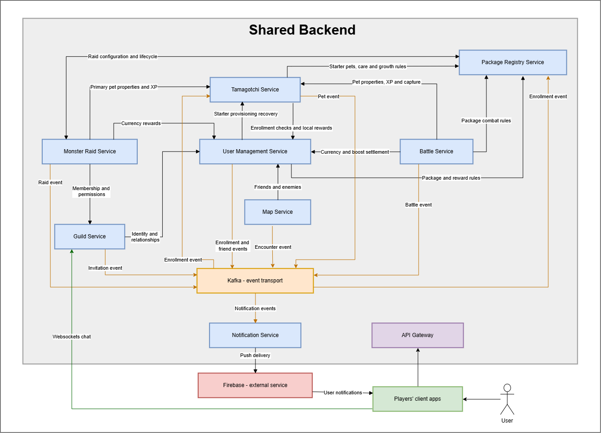
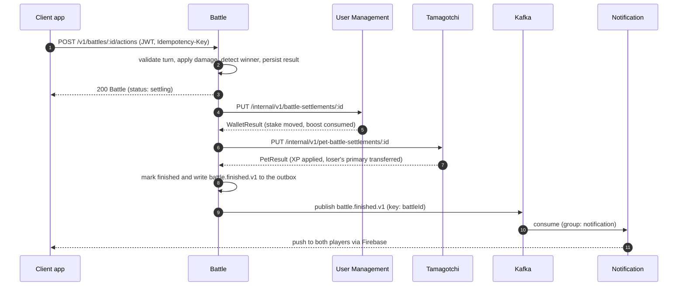

# Tamagotchi Go

Team 8's project for Distributed Applications Programming (PAD), Autumn 2026.

Tamagotchi Go is a shared backend for virtual-pet apps. Players raise a pet, meet nearby players, fight turn-based battles, join guilds and take down raid monsters together. Pets from different apps live in the same multiplayer world.

**Contents:** [Team](#team) · [Architecture](#architecture) · [Services](#services) · [Technologies](#technologies-and-communication-patterns) · [Communication contract](#communication-contract) · [Endpoint catalog](#endpoint-catalog) · [Contribution workflow](#contribution-workflow)

## Team

| Person | GitHub | Services | Language |
| --- | --- | --- | --- |
| Alexei | [AlexDandy77](https://github.com/AlexDandy77) | User Management, Battle | Go |
| Artur | [arturtugui](https://github.com/arturtugui) | Tamagotchi, Notification | TypeScript |
| Alexandru | [AlexandruRudoi](https://github.com/AlexandruRudoi) | Map, Monster Raid | Go |
| Nicolae | [xnikug](https://github.com/xnikug) | Guild, Package Registry | TypeScript |

Each service lives in its own private repository, linked under [`services/`](services) as a Git submodule.

## How the game works

- **Client apps** are built by package developers. A client shows the pet, sends care actions, location updates, battle moves and chat messages, and displays what the backend returns.
- **Packages** are the registered apps. A package defines its own pet statistics (a dragon app may use hunger and happiness, a robot app energy and discipline), starter pets and care rules. The backend stores those definitions; it never runs client code.
- **The backend** is the eight services below. It validates every action and owns all persistent game data. Clients request actions; they cannot award themselves currency, XP or victories.

## Architecture

### System overview



Client apps reach every service through a single **API Gateway**, and each service owns its own PostgreSQL database with its own credentials — services never share a database. Neither of these is drawn as a separate box per service in the diagram above but both apply to all eight backend services. The one exception on the gateway side is Guild's chat: client apps hold a direct WebSocket connection to Guild Service for real-time messages, shown as the green line bypassing the gateway. Firebase Cloud Messaging is also reached directly by client apps for push delivery, independent of the gateway.

Black arrows are direct HTTP calls between services. Orange arrows are events flowing through Kafka.

### Service dependencies

The service dependencies are the black arrows above — direct HTTP calls, not routed through the API Gateway. Authentication calls (every service verifies JWTs with User Management's public keys) aren't drawn, for the same readability reason.

- **Monster Raid → Package Registry** — raid configuration and lifecycle, plus reward rule lookups.
- **Tamagotchi → Package Registry** — starter pet definitions, care and growth rules.
- **Battle → Package Registry** — package combat rules, plus reward rule lookups.
- **Battle → Tamagotchi** — pet properties, XP and capture at battle settlement.
- **Monster Raid → Tamagotchi** — primary pet properties and XP for participating members.
- **Tamagotchi → User Management** — enrollment checks and local reward settlement.
- **User Management → Tamagotchi** — starter-pet provisioning recovery, a fallback if the enrollment event was missed.
- **Monster Raid → User Management** — currency reward settlement.
- **Battle → User Management** — currency and boost settlement.
- **Map → User Management** — friends/enemies lookups, used to decide what an encounter should trigger.
- **Guild → User Management** — identity and relationship lookups for membership and invite eligibility.
- **Monster Raid → Guild** — membership and permission checks before a member can join a raid.

### Event flow

The event flow is represented with orange arrows above. Anything that doesn't have to happen before a response is sent travels as an event through Kafka instead of a direct call.

User Management publishes `user.package-registered.v1` on enrollment; Package Registry and Tamagotchi both consume it independently to provision their own side of a new enrollment. Six services — User Management, Map, Battle, Tamagotchi, Guild and Monster Raid — publish their own domain events (friend requests, encounters, battle results, pet use/capture, guild invites, raid results) onto a shared topic that Notification consumes exclusively; Notification turns every one of those into a push message and hands it to Firebase Cloud Messaging, which delivers it straight to the client app.

### Example: finishing a battle

The player's request is answered as soon as the result is stored; settlement with the data owners and the notification happen afterwards.



### Decisions to confirm

The brief leaves some boundaries open. These are our choices; they can change after discussion with the professor.

| Question | Our choice |
| --- | --- |
| The brief tells Guild to use "Registry" for identity and relationships, but User Management owns those. | Guild asks User Management. |
| Both User Management and Package Registry record user-package enrollments. | User Management is authoritative; Registry keeps a read-only projection fed by events. |
| Who creates battle challenges and matches? | Battle owns challenges, acceptance and match creation. |
| Local currency rules differ per package. | User Management stores balances per user and package; Registry stores the rules. |
| Losing a battle transfers the loser's primary pet. | Tamagotchi transfers the existing record; the winner keeps its primary and gains a secondary; the loser must pick a new primary. |
| Proximity threshold is written as "6(?)" meters. | 6 meters, locations fresh for 120 seconds. |

## Services

Each service is the only writer of its data. Other services ask the owner through its API; a reference to a user, pet, package or guild points at the existing record and never creates a copy.

### 1. User Management

- **Owns:** accounts, credentials and roles; friend requests, friendships and enemy marks; which packages a user is enrolled in; global and local currency balances; battle boosts and their holds.
- **Does:** issues JWTs, answers "who is this user", "are they friends", "can they afford this stake"; applies currency results reported by Battle and Monster Raid.
- **Not here:** pets (Tamagotchi), guild membership (Guild), package definitions (Package Registry).

### 2. Battle

- **Owns:** challenges, accepted matches, chosen pets and boosts, frozen combat inputs, turn and HP state, the outcome and settlement progress.
- **Does:** computes damage from levels, type advantage, boosts and package care bonuses; decides winner rewards and the primary/secondary XP split; asks User Management and Tamagotchi to apply them.
- **Not here:** currency balances or persistent pet records (never edited directly); cooperative fights (Monster Raid).

### 3. Tamagotchi

- **Owns:** every pet: identity, origin package, owner, combat type, level, XP, sprites and package-specific care statistics; primary and secondary assignments; pet reservations for battles and raids.
- **Does:** creates the starter pet on enrollment, validates care actions against the package's pinned rules, applies XP and ownership transfers after battles and raids.
- **Not here:** a battle's temporary HP (Battle); the definition of a statistic (Package Registry).

### 4. Notification

- **Owns:** push device registrations and notification records.
- **Does:** consumes events (friend request, encounter, battle request or result, pet used or captured, guild invitation, raid start or result), decides who receives what, and delivers it through Firebase.
- **Not here:** guild chat (Guild); any game decision.

### 5. Map

- **Owns:** each user's latest location and timestamp; encounter state.
- **Does:** ignores stale updates, keeps friends and enemies visible, detects strangers within 6 meters and publishes an encounter event that may lead to a friend request or a battle.
- **Not here:** challenges (Battle) and alerts (Notification).

### 6. Monster Raid

- **Owns:** active raid instances: monster HP, participants, damage per participant, timer and status.
- **Does:** starts raids from Registry schedules, checks guild eligibility and reserves primary pets, processes clicker-style attacks with a one-second cooldown, and requests rewards from User Management and Tamagotchi on victory.
- **Not here:** monster and schedule definitions (Package Registry); membership (Guild).

### 7. Guild

- **Owns:** guilds, invitations, members and roles (leader, officer, member); chat messages with a per-guild sequence.
- **Does:** enforces membership and permission rules, runs the guild chat over WebSockets, and tells Monster Raid who is eligible.
- **Not here:** friendships and enemies (User Management); the raid itself (Monster Raid).

### 8. Package Registry

- **Owns:** packages and their moderators; immutable package configurations (starter pets, statistics, care actions, combat bonus thresholds); global combat rules; monster definitions; raid schedules.
- **Does:** lets admins register packages and configure monsters and raids, lets moderators publish package rules, keeps a projection of enrollments, and tells Monster Raid when a raid starts or is cancelled.
- **Not here:** a pet's current statistic values (Tamagotchi); live raid state (Monster Raid).

## Technologies and communication patterns

The team works in **Go and TypeScript**. Each person implements both of their services in one language.

| Service | Owner | Language and framework | Storage | Communication |
| --- | --- | --- | --- | --- |
| User Management | Alexei | Go, `net/http` | PostgreSQL `users` | HTTP/JSON; publishes enrollment and friend events |
| Battle | Alexei | Go, `net/http` | PostgreSQL `battles` | HTTP/JSON with client polling of battle state; publishes battle events |
| Tamagotchi | Artur | TypeScript, Fastify | PostgreSQL `pets` (JSONB for package statistics) | HTTP/JSON; consumes enrollment events; publishes pet events |
| Notification | Artur | TypeScript, Fastify | PostgreSQL `notifications` | HTTP/JSON for devices; consumes Kafka events; Firebase push |
| Map | Alexandru | Go, `net/http` | PostgreSQL `locations` | HTTP/JSON; publishes encounter events |
| Monster Raid | Alexandru | Go, `net/http` | PostgreSQL `raids` | HTTP/JSON with client polling of raid state; publishes raid events |
| Guild | Nicolae | TypeScript, Fastify | PostgreSQL `guilds` | HTTP/JSON; WebSocket chat; publishes invitation events |
| Package Registry | Nicolae | TypeScript, Fastify | PostgreSQL `registry` (JSONB for configurations) | HTTP/JSON; consumes enrollment events |

**Why two languages, and these two.** Go's standard library gives small, fast binaries with built-in concurrency, which fits the request-heavy, timer-driven services (settlement, combat, location updates, raid attacks). TypeScript with Fastify gives schema-validated routes, JSON-native handling of package-specific statistics and easy WebSocket support, which fits pets, notifications, chat and configuration. One language per person avoids context switching. The cost is keeping validation and serialization equivalent in both stacks; the language-neutral contract below is the shared reference.

**PostgreSQL per service.** Balances, ownership, holds and combat state need local transactions; PostgreSQL gives them, and JSONB stores each package's differently named statistics without a shared schema. Separate databases make ownership explicit at the cost of cross-service consistency work, handled with the outbox and settlement flows below. For the lab, one PostgreSQL server can host all databases with separate credentials.

**HTTP/JSON for requests.** Synchronous calls handle decisions the caller must know immediately, such as reserving pets or checking eligibility. JSON is inspectable from both languages and from any client app. Calls time out after two seconds and unfinished work stays visible for retry. Clients poll battle and raid resources; guild chat uses WebSockets because it needs continuous delivery, and therefore reconnect and history replay.

**Kafka for events.** Events are an append-only log: a consumer that was down (Notification, Registry) catches up from its last offset, and a new projection can replay history. Partitioning by `aggregateId` keeps events for one battle, raid or request in order. The cost is a heavier broker to run and no per-message routing; the lab uses a single-node Kafka in Docker and one topic per event type.

**Firebase Cloud Messaging** is the push provider required by the brief. A push carries only `eventId`, `type` and `targetId`; the client fetches the authoritative state after opening it. Firebase needs a project, a service-account key kept out of Git, and a client that produces device tokens.

## Communication contract

Contract version **1.0.0**. This is the proposed interface, not a running system.

- [`contracts/openapi.yaml`](contracts/openapi.yaml): every HTTP path, parameter, body, response and caller restriction (OpenAPI 3.1).
- [`contracts/events.schema.json`](contracts/events.schema.json): the ten Kafka event envelopes and payloads (JSON Schema).
- [`contracts/realtime.schema.json`](contracts/realtime.schema.json): the six guild chat WebSocket frames (JSON Schema).
- [`contracts/field-dictionary.md`](contracts/field-dictionary.md): readable definitions of every request, response, event and frame type named in the tables below.
- [`contracts/game-rules.md`](contracts/game-rules.md): the numbers and formulas behind the contract.

### Rules

| Item | Rule |
| --- | --- |
| Addressing | Paths are relative to the owning service's origin. Public paths start with `/v1`; `/internal/v1` paths are for service-to-service calls only. |
| Format | `application/json`, UTF-8, camelCase keys. Unknown fields are rejected. IDs are UUID strings; versions are positive integers; times are RFC 3339 UTC (`2026-09-09T10:00:00Z`); currency is whole units up to 2^53 - 1. |
| User authentication | `Authorization: Bearer <accessToken>`. User Management issues RS256 JWTs valid for 15 minutes; every service verifies them with the JWKS endpoint. Refresh tokens are opaque, rotated on use and valid for at most 30 days. |
| Roles | `player`: any authenticated user, with ownership or membership checked per resource. `moderator/admin`: a moderator of that package or a global admin. `admin`: global admin. Clients cannot grant roles. |
| Service authentication | `internal` routes require mutual TLS plus the per-endpoint caller allowlist in OpenAPI. A player token alone cannot call them. |
| Idempotency | Every mutation sends a UUID `Idempotency-Key`, except authentication and location updates. The same key and body replays the stored outcome; a different body returns `409`. Keys are kept for at least 24 hours; settlement and provisioning IDs permanently. |
| Concurrency | `expectedVersion` and `expectedTurn` reject stale writes with `409`. Balances, reservations and raid HP change inside database transactions. |
| Pagination | `cursor?` and `limit?` (1 to 100, default 20) return `{items, nextCursor}`. Chat history uses `afterSequence` and `hasMore`. |
| Responses | Success codes are listed per endpoint; `204` has no body, `202` means work continues and the client polls, `101` is a WebSocket upgrade. Errors: `400` malformed, `401` unauthenticated, `403` forbidden, `404` missing, `409` conflict, `422` invalid value, `429` rate or cooldown limit, `503` dependency unavailable. All errors use the `Error` body. |
| Timeouts and retries | Service-to-service calls time out after 2 seconds. After a timeout on a mutation, retry with the same key and read the state; never assume it failed. |
| Evolution | Optional fields may be added compatibly. Breaking HTTP changes get `/v2`; breaking events get a new type suffix. |

Example: `POST /v1/pets/{petId}/care` with a bearer token and an `Idempotency-Key`:

```json
{"actionId":"feed","expectedVersion":3}
```

A stale version returns `409`:

```json
{
  "error": {
    "code": "VERSION_CONFLICT",
    "message": "Refresh the pet before performing another action.",
    "requestId": "00000000-0000-4000-8000-000000000001",
    "details": [{"field":"expectedVersion","reason":"Current version is 4."}]
  }
}
```

### Data ownership and consistency

| Owner | Authoritative data | Reads from others |
| --- | --- | --- |
| User Management | accounts, sessions, friends and enemies, enrollments, global and local currency, boosts, holds, reward ledger | package status, combat rules, raid rewards (Registry) |
| Battle | challenges, loadouts, frozen inputs, turn and HP state, outcome, settlement progress | reserved pets (Tamagotchi), rules (Registry), wallet holds (User Management) |
| Tamagotchi | pets, primary and secondary references, care progression, XP, reservations, ownership transfers | enrollment (User Management), package rules (Registry) |
| Notification | device tokens, notification records, processed-event inbox | events (Kafka), Firebase responses |
| Map | latest location per user, encounter state | profiles and relationships (User Management) |
| Monster Raid | raid instance, participants, HP, damage, timer, reward progress | monster and schedule snapshot (Registry), eligibility (Guild), frozen pets (Tamagotchi) |
| Guild | guilds, invitations, members and roles, chat messages and sequence | identity and relationships (User Management) |
| Package Registry | packages, moderators, immutable configurations, global rules, monsters, schedules | enrollment projection (User Management, via Kafka) |

There are no cross-database writes or foreign keys; IDs cross the API boundary and the owner validates them. A service that publishes an event writes the business change and an outbox row in one transaction; a worker publishes the outbox with a stable `eventId`. Consumers store processed event IDs in an inbox before committing offsets, and compare `aggregateVersion` so an old event never overwrites a newer state. Failed messages retry with backoff and then land in a dead-letter topic.

Cross-service workflows complete eventually rather than in one distributed transaction:

1. **Enrollment and starter pet.** User Management commits the enrollment and emits `user.package-registered.v1`. Registry records the projection; Tamagotchi provisions exactly one starter per user and package. Until then `GET /v1/pets` may be empty.
2. **Care rewards.** Tamagotchi stores the action and calls User Management's local-reward endpoint with the action ID. User Management enforces the daily cap; `CareResult.localRewardStatus` stays `pending` until it settles. Retrying the care request never applies the stat change twice.
3. **Starting a battle.** Battle reserves currency and boosts for both users in User Management and all four pets in Tamagotchi. Combat starts only after both holds succeed; a failed hold releases the other and cancels the battle. Held pets cannot be cared for, reassigned or used elsewhere.
4. **Finishing a battle.** Battle stores the result, then asks User Management to move the stake and Tamagotchi to apply XP and transfer the loser's primary, both keyed by battle ID. The battle shows `settling` until both confirm, then `finished`, then emits `battle.finished.v1`. Retries reuse the same IDs; a completed reward is never repeated or reversed.
5. **Raids.** Registry dispatches a due schedule with `raidId = scheduleId`. Monster Raid pins the configuration, reserves each joining member's primary, updates HP atomically per attack, and on victory settles currency once per raid and XP once per participant. Cancellation writes a tombstone so a late start cannot run; once victory settlement begins, cancellation returns `409`.

### Game rules in short

Full values and formulas are in [`contracts/game-rules.md`](contracts/game-rules.md).

- **Types:** `flame → nature → earth → electric → water → shadow → flame`. Attacking the next type deals 1.5×, the previous type 0.75×.
- **Battle:** each player stakes 10 global coins; the winner takes them and captures the loser's primary pet. Winner pets earn 100 XP, loser pets 40, split 60/40 between primary and secondary. `level = min(100, 1 + floor(xp / 100))`. Challenges expire after 5 minutes; turns last 30 seconds; timeout or forfeit loses.
- **Care:** at most 10 XP per action, 100 XP per pet per day and 100 local currency per user and package per day. Care bonuses in battle are capped at 10%.
- **Raids:** one attack per second per member; monster weakness 1.5×, resistance 0.75×, `armored` halves damage. Every participant with damage above zero receives the configured reward on victory.
- **Map and guilds:** strangers count as nearby within 6 meters when both locations are under 120 seconds old. A guild has at most 100 members.

### Endpoint catalog

Path parameters and listed bodies are required. `cursor?` and `limit?` are optional query parameters. Named types are defined in the [field dictionary](contracts/field-dictionary.md); every route also returns the shared error responses. Behavioral details per endpoint (who may call it, what is validated, what is atomic) are in the OpenAPI descriptions.

#### User Management

| Method and path | Caller | Body / query | Success | Purpose |
| --- | --- | --- | --- | --- |
| `POST /v1/auth/register` | public | `Register` | `201` `Session` | Create an account and its first enrollment |
| `POST /v1/auth/login` | public | `Login` | `200` `Session` | Create a session |
| `POST /v1/auth/refresh` | public | `Refresh` | `200` `Session` | Rotate the refresh token |
| `POST /v1/auth/logout` | public | `Refresh` | `204` | Revoke the refresh session |
| `GET /.well-known/jwks.json` | public | — | `200` `JWKS` | Public keys for token verification |
| `GET /v1/users/me` | player | — | `200` `User` | Own private profile |
| `PATCH /v1/users/me` | player | `ProfileUpdate` | `200` `User` | Change the username |
| `GET /v1/users/{userId}` | player | — | `200` `PublicUser` | Public profile of a user |
| `PUT /v1/users/me/packages/{packageId}` | player | — | `200` `Enrollment` | Enroll in a package (idempotent; publishes an event) |
| `POST /v1/friend-requests` | player | `FriendRequestInput` | `201` `FriendRequest` | Send a friend request |
| `GET /v1/friend-requests` | player | `cursor?`, `limit?` | `200` `FriendRequestPage` | Sent and received requests |
| `PUT /v1/friend-requests/{requestId}/decision` | player | `RequestDecision` | `200` `FriendRequest` | Recipient accepts or rejects |
| `DELETE /v1/friend-requests/{requestId}` | player | — | `204` | Sender cancels a pending request |
| `DELETE /v1/friends/{userId}` | player | — | `204` | Remove a friendship |
| `GET /v1/relationships` | player | `cursor?`, `limit?` | `200` `RelationshipPage` | Friends and enemies |
| `PUT /v1/enemies/{userId}` | player | — | `200` `Relationship` | Mark an enemy (removes a friendship) |
| `DELETE /v1/enemies/{userId}` | player | — | `204` | Remove an enemy mark |
| `GET /v1/wallet` | player | — | `200` `Wallet` | Currencies and available boosts |
| `GET /internal/v1/relationships` | internal | `userId`, `otherUserId` | `200` `Relationship` | Relationship between two users |
| `GET /internal/v1/users/{userId}/relationships` | internal | `cursor?`, `limit?` | `200` `RelationshipPage` | Relationships for map visibility |
| `GET /internal/v1/users/{userId}/packages/{packageId}` | internal | — | `200` `Enrollment` | Verify an enrollment |
| `PUT /internal/v1/battle-holds/{battleId}` | internal | `BattleHoldInput` | `200` `Hold` | Reserve both stakes and boosts |
| `DELETE /internal/v1/battle-holds/{battleId}` | internal | — | `204` | Release a battle hold |
| `PUT /internal/v1/battle-settlements/{battleId}` | internal | `BattleMoneyResult` | `200` `WalletResult` | Apply the battle currency result |
| `PUT /internal/v1/raid-settlements/{raidId}` | internal | `RaidMoneyInput` | `200` `WalletResult` | Apply raid currency rewards |
| `PUT /internal/v1/local-rewards/{operationId}` | internal | `LocalRewardInput` | `200` `LocalRewardResult` | Apply one care-action reward |

#### Battle

| Method and path | Caller | Body / query | Success | Purpose |
| --- | --- | --- | --- | --- |
| `POST /v1/battles` | player | `BattleCreate` | `201` `Battle` | Challenge another player |
| `GET /v1/battles` | player | `cursor?`, `limit?` | `200` `BattlePage` | Own battles |
| `GET /v1/battles/{battleId}` | player | — | `200` `Battle` | Battle state and settlement |
| `POST /v1/battles/{battleId}/accept` | player | `BattleAccept` | `202` `Battle` | Opponent accepts; holds are reserved, then combat starts |
| `POST /v1/battles/{battleId}/decline` | player | — | `200` `Battle` | Opponent declines |
| `DELETE /v1/battles/{battleId}` | player | — | `204` | Challenger cancels before combat |
| `POST /v1/battles/{battleId}/actions` | player | `BattleAction` | `200` `Battle` | Attack or forfeit |

#### Tamagotchi

| Method and path | Caller | Body / query | Success | Purpose |
| --- | --- | --- | --- | --- |
| `GET /v1/pets` | player | — | `200` `PetRoster` | Owned pets and current primary |
| `GET /v1/pets/{petId}` | player | — | `200` `Pet` | One owned pet |
| `PUT /v1/pets/primary` | player | `PrimaryInput` | `200` `PetRoster` | Select the primary pet |
| `POST /v1/pets/{petId}/care` | player | `CareInput` | `200` `CareResult` | Perform a care action |
| `GET /v1/care-actions/{operationId}` | player | — | `200` `CareResult` | Care action and its reward status |
| `GET /v1/pet-types` | player | — | `200` `TypeCatalog` | The six types and the advantage cycle |
| `PUT /internal/v1/starter-pets/{operationId}` | internal | `StarterInput` | `200` `Pet` | Provision a starter pet exactly once |
| `PUT /internal/v1/pet-reservations/{activityId}` | internal | `PetReserveInput` | `200` `PetReservation` | Reserve pets and return frozen combat properties |
| `DELETE /internal/v1/pet-reservations/{activityId}` | internal | — | `204` | Release reserved pets without rewards |
| `PUT /internal/v1/pet-battle-settlements/{battleId}` | internal | `PetBattleResult` | `200` `PetResult` | Apply XP and transfer the loser's primary |
| `PUT /internal/v1/pet-raid-settlements/{activityId}` | internal | `PetRaidResult` | `200` `PetResult` | Apply raid XP and release the pet |

#### Notification

| Method and path | Caller | Body / query | Success | Purpose |
| --- | --- | --- | --- | --- |
| `PUT /v1/notification-devices/{deviceId}` | player | `DeviceInput` | `200` `Device` | Register or refresh a push device |
| `DELETE /v1/notification-devices/{deviceId}` | player | — | `204` | Remove a push device |
| `GET /v1/notifications` | player | `cursor?`, `limit?` | `200` `NotificationPage` | Own notifications |
| `PUT /v1/notifications/{notificationId}/read` | player | — | `200` `Notification` | Mark a notification as read |

#### Map

| Method and path | Caller | Body / query | Success | Purpose |
| --- | --- | --- | --- | --- |
| `PUT /v1/map/location` | player | `LocationInput` | `200` `LocationResult` | Report the current location |
| `GET /v1/map/nearby` | player | `cursor?`, `limit?` | `200` `MapEntryPage` | Friends, enemies and strangers within 6 meters |

#### Monster Raid

| Method and path | Caller | Body / query | Success | Purpose |
| --- | --- | --- | --- | --- |
| `PUT /internal/v1/raids/{raidId}` | internal | `RaidStart` | `200` `Raid` | Start the raid for a schedule (`raidId` = `scheduleId`) |
| `DELETE /internal/v1/raids/{raidId}` | internal | — | `204` | Cancel a raid, recording a tombstone |
| `GET /v1/raids` | player | `guildId`, `cursor?`, `limit?` | `200` `RaidPage` | Raids of a guild you belong to |
| `GET /v1/raids/{raidId}` | player | — | `200` `Raid` | Raid state and results |
| `POST /v1/raids/{raidId}/participants` | player | `RaidJoin` | `201` `RaidParticipant` | Join with your primary pet |
| `POST /v1/raids/{raidId}/attacks` | player | — | `200` `Raid` | One attack, one-second cooldown per member |

#### Guild

| Method and path | Caller | Body / query | Success | Purpose |
| --- | --- | --- | --- | --- |
| `POST /v1/guilds` | player | `GuildInput` | `201` `Guild` | Create a guild and become its leader |
| `GET /v1/guilds` | player | `cursor?`, `limit?` | `200` `GuildPage` | Guilds you belong to |
| `GET /v1/guilds/{guildId}` | player | — | `200` `Guild` | One of your guilds |
| `PATCH /v1/guilds/{guildId}` | player | `GuildInput` | `200` `Guild` | Edit a guild (leader or officer) |
| `GET /v1/guilds/{guildId}/members` | player | `cursor?`, `limit?` | `200` `MemberPage` | Guild members |
| `POST /v1/guilds/{guildId}/invitations` | player | `FriendRequestInput` | `201` `GuildInvite` | Invite a user (leader or officer) |
| `GET /v1/guild-invitations` | player | `cursor?`, `limit?` | `200` `GuildInvitePage` | Received invitations |
| `PUT /v1/guild-invitations/{invitationId}/decision` | player | `RequestDecision` | `200` `GuildInvite` | Accept or reject an invitation |
| `DELETE /v1/guild-invitations/{invitationId}` | player | — | `204` | Revoke a pending invitation |
| `PUT /v1/guilds/{guildId}/members/{userId}/role` | player | `RoleInput` | `200` `Member` | Change a member's role (leader) |
| `PUT /v1/guilds/{guildId}/leader` | player | `LeaderInput` | `200` `Guild` | Transfer leadership |
| `DELETE /v1/guilds/{guildId}/members/{userId}` | player | — | `204` | Leave, or remove a member |
| `GET /v1/guilds/{guildId}/messages` | player | `afterSequence?`, `limit?` | `200` `ChatHistory` | Replay chat history |
| `GET /v1/guilds/{guildId}/chat` | public | — | `101` | WebSocket upgrade for guild chat |
| `GET /internal/v1/guilds/{guildId}/members/{userId}/eligibility` | internal | — | `200` `Eligibility` | Raid eligibility of a member |
| `GET /internal/v1/guilds/{guildId}/members` | internal | `cursor?`, `limit?` | `200` `MemberPage` | Members for raid announcements |

#### Package Registry

| Method and path | Caller | Body / query | Success | Purpose |
| --- | --- | --- | --- | --- |
| `POST /v1/packages` | admin | `PackageInput` | `201` `Package` | Register a participating app |
| `GET /v1/packages` | public | `cursor?`, `limit?` | `200` `PackagePage` | Active packages |
| `GET /v1/packages/{packageId}` | public | — | `200` `Package` | Package metadata |
| `PATCH /v1/packages/{packageId}` | moderator/admin | `PackageUpdate` | `200` `Package` | Update metadata or status |
| `PUT /v1/packages/{packageId}/moderators/{userId}` | admin | — | `200` `Package` | Assign a moderator |
| `DELETE /v1/packages/{packageId}/moderators/{userId}` | admin | — | `204` | Remove a moderator |
| `POST /v1/packages/{packageId}/configurations` | moderator/admin | `PackageConfigInput` | `201` `PackageConfig` | Publish an immutable configuration |
| `GET /v1/packages/{packageId}/configurations/{configVersion}` | public | — | `200` `PackageConfig` | Read a pinned configuration |
| `GET /v1/packages/{packageId}/users` | moderator/admin | `cursor?`, `limit?` | `200` `EnrollmentPage` | Users enrolled in the package |
| `GET /v1/combat-rules/{rulesVersion}` | public | — | `200` `CombatRules` | Global combat and progression rules |
| `POST /v1/monsters` | admin | `MonsterInput` | `201` `Monster` | Create a monster |
| `GET /v1/monsters` | player | `cursor?`, `limit?` | `200` `MonsterPage` | Monster definitions |
| `GET /v1/monsters/{monsterId}` | player | — | `200` `Monster` | One monster |
| `GET /internal/v1/monsters/{monsterId}/versions/{monsterVersion}` | internal | — | `200` `Monster` | Pinned monster version |
| `POST /v1/raid-schedules` | admin | `ScheduleInput` | `201` `Schedule` | Schedule a guild raid |
| `GET /v1/raid-schedules` | admin | `cursor?`, `limit?` | `200` `SchedulePage` | Raid schedules |
| `GET /v1/raid-schedules/{scheduleId}` | admin | — | `200` `Schedule` | One schedule |
| `PUT /v1/raid-schedules/{scheduleId}/status` | admin | `ScheduleStatus` | `200` `Schedule` | Activate, deactivate or cancel |
| `GET /internal/v1/raid-schedules/{scheduleId}/versions/{scheduleVersion}` | internal | — | `200` `Schedule` | Pinned schedule version |

### Kafka event contract

Each event type has its own Kafka topic named after the type. The message key is `aggregateId`, so events about one request, pet, battle, raid or enrollment stay in order within a partition. Each consuming service reads with its own consumer group and commits offsets only after durable processing. Producers publish from their outbox with `acks=all` and the idempotent producer setting, reusing the same `eventId` on retry. Topics retain events for 7 days; messages that keep failing go to `<topic>.dlq`. Topic ACLs allow writes only from the listed producer.

Every message carries the `EventEnvelope` fields (`eventId`, `type`, `schemaVersion`, `occurredAt`, `producer`, `aggregateId`, `aggregateVersion`, `correlationId`) and a typed `data` object. Consumers validate both.

| Topic | Producer | Consumer groups | Data type |
| --- | --- | --- | --- |
| `user.package-registered.v1` | user-management | package-registry, tamagotchi | `UserPackageRegisteredV1Data` |
| `friend.requested.v1` | user-management | notification | `FriendRequestedV1Data` |
| `map.encountered.v1` | map | notification | `MapEncounteredV1Data` |
| `battle.requested.v1` | battle | notification | `BattleRequestedV1Data` |
| `battle.finished.v1` | battle | notification | `BattleFinishedV1Data` |
| `pet.used.v1` | tamagotchi | notification | `PetUsedV1Data` |
| `pet.captured.v1` | tamagotchi | notification | `PetCapturedV1Data` |
| `guild.invited.v1` | guild | notification | `GuildInvitedV1Data` |
| `raid.started.v1` | monster-raid | notification | `RaidStartedV1Data` |
| `raid.finished.v1` | monster-raid | notification | `RaidFinishedV1Data` |

Notification derives recipients from the payload: the recipient of a friend or guild request, the opponent of a battle request, both players of a finished battle, both users of an encounter, the owners involved in a pet use or capture, and the member snapshot of a raid. Clients never publish events or choose recipients.

```json
{
  "eventId": "00000000-0000-4000-8000-000000000010",
  "type": "friend.requested.v1",
  "schemaVersion": "1",
  "occurredAt": "2026-09-09T10:00:00Z",
  "producer": "user-management",
  "aggregateId": "00000000-0000-4000-8000-000000000011",
  "aggregateVersion": 1,
  "correlationId": "00000000-0000-4000-8000-000000000012",
  "data": {
    "requestId": "00000000-0000-4000-8000-000000000011",
    "senderId": "00000000-0000-4000-8000-000000000013",
    "recipientId": "00000000-0000-4000-8000-000000000014"
  }
}
```

### Guild chat WebSocket contract

Connect to the Guild service at `wss://<guild-origin>/v1/guilds/{guildId}/chat`. The upgrade returns `101` but grants nothing yet: within five seconds the client must send `ChatAuthenticate`; the server checks the JWT and guild membership and replies with `ChatAuthenticated`, or closes with code `1008`. Losing membership or token expiry also closes the connection.

| Direction | Frame | Content |
| --- | --- | --- |
| client to server | `ChatAuthenticate` | `{type:"authenticate", accessToken}`; must be the first frame |
| server to client | `ChatAuthenticated` | `{type:"authenticated", guildId, userId, latestSequence}` |
| client to server | `ChatSend` | `{type:"message.send", requestId, content}`; content is 1 to 2,000 characters |
| server to sender | `ChatAck` | `{type:"message.ack", requestId, message}` after the message is stored |
| server to members | `ChatCreated` | `{type:"message.created", message}` |
| server to client | `ChatError` | `{type:"error", requestId or null, code, message}` |

The server assigns sender, guild, timestamp and a per-guild increasing sequence. Resending the same `requestId` with the same content replays the acknowledgement; different content returns `IDEMPOTENCY_CONFLICT`. After a reconnect, call `GET /v1/guilds/{guildId}/messages?afterSequence=<last-seen>` until `hasMore` is false. Ping and pong use WebSocket control frames.

## Contribution workflow

### Branches and merge rules

| Branch | Purpose | How changes arrive |
| --- | --- | --- |
| `main` | Approved releases; the default branch | Release PR from `dev`, **2 approvals** |
| `dev` | Integration of finished work | Task PR, **2 approvals** |
| `<type>/<scope>/<description>` | One task | Branched from the latest `dev`; PR into `dev` |

Both `main` and `dev` are protected: changes arrive only through a pull request with two approving reviews from other collaborators, all review conversations resolved, a passing **Validate contracts** check and a branch that is up to date with its target. A new push dismisses earlier approvals. Direct pushes, force pushes and branch deletion are blocked for everyone, including administrators.

Merge strategies:

- **Rebase and merge** is the default. Use it for a PR with a few focused commits; they land unchanged, keeping a linear history.
- **Squash and merge** is used when a PR has about ten or more commits or is full of fix-up commits. The squashed title follows the commit rules below; the original commits stay visible in the PR.
- **Create a merge commit** is used only for release PRs from `dev` to `main`, so `main` keeps the same commits as `dev` and the next release contains only the new work.

A release is a PR from `dev` to `main`, opened once the work for that release is merged into `dev` and validated. The PR lists the version and the notable changes. After the merge, the `main` commit is tagged `vMAJOR.MINOR.PATCH`.

### Branch naming

`<type>/<scope>/<short-description>`, lowercase with hyphens. Scope is a service name (`user-management`, `tamagotchi`, `battle`, `notification`, `map`, `monster-raid`, `guild`, `package-registry`) or `common` for the shared repository. The issue number goes in the PR and the closing commit, not the branch.

| Type | Example |
| --- | --- |
| `feat` | `feat/battle/challenge-flow` |
| `fix` | `fix/tamagotchi/duplicate-rewards` |
| `docs` | `docs/common/contribution-rules` |
| `test` | `test/monster-raid/attack-cooldown` |
| `ci`, `refactor`, `chore` | `ci/common/contract-validation` |

Start from an updated `dev`, keep commits focused, and open the PR against `dev`. To update a PR, rebase your branch onto the target and push with `--force-with-lease`; never force-push `main`, `dev` or someone else's branch. Delete the branch after it merges.

### Commits and pull requests

Commit titles are single-line Conventional Commits: `type(scope): imperative summary`, with types `feat`, `fix`, `docs`, `refactor`, `test`, `ci`, `chore` and an optional service scope. Reference the issue in the commit that completes it, for example `docs: define stack and API contracts (closes #2, closes #3)`. An issue closes when the commit reaches `main`.

Every PR uses the [PR template](.github/PULL_REQUEST_TEMPLATE.md) and explains the problem and the change, as well as the related issue if exists. Reviewers check the actual diff against the shared contract; approvals are dismissed by new pushes and must be obtained again.

### Validation and test coverage

The [Contract validation workflow](.github/workflows/validate-contracts.yml) runs on every PR to `main` or `dev` and publishes the required **Validate contracts** check. It validates the OpenAPI and JSON Schema files, checks that this README lists every route and event and that the field dictionary defines every type, validates the examples, and confirms that malformed payloads are rejected. Run it locally with:

```sh
python3 -m venv .venv
.venv/bin/python -m pip install -r .github/scripts/requirements.txt
.venv/bin/python .github/scripts/check_contracts.py
```

Service code needs **80% statement coverage and 70% branch coverage per service**, in both languages, enforced by each service's CI from its first implementation PR. Go measures statements with `go test -coverprofile=coverage.out ./...` and branches with `gobco`; TypeScript measures both with Vitest's coverage report. Generated code, dependencies and fixtures are excluded; application logic is not. A percentage alone is not enough: every PR that changes behavior adds or updates tests at the level where that behavior lives.

| Level | What it covers | Tooling |
| --- | --- | --- |
| Unit | Pure domain logic: damage and HP formulas, type multipliers, XP split and levels, cooldowns and timers, validation, cursor encoding. Table-driven, one row per case. | Go `testing`; Vitest |
| Handler / integration | Each endpoint through the real router against a test database or a fake repository: success, every documented error status, authorization and ownership, idempotent replay, version conflicts. | Go `net/http/httptest`; Fastify `inject()` |
| Contract | Request and response bodies validate against `contracts/openapi.yaml`; published events against `contracts/events.schema.json`. | OpenAPI or JSON Schema validator |
| Consumer / worker | Event consumers and outbox workers: duplicate delivery, out-of-order `aggregateVersion`, poison messages to the dead-letter topic, publisher retries. | Same as above |

Edge cases to cover whenever they apply: boundary values (zero, maximum, one past the limit), empty and full pages, missing and null optional fields, unknown IDs, expired tokens, the wrong caller, the same request repeated with the same and with a changed `Idempotency-Key`, a stale `expectedVersion`, dependency timeouts and `503`, and timers that expire mid-request. Test names describe scenario and outcome (`TestAttack_RejectsSecondClickWithinCooldown`). Tests inject a clock and build fresh fixtures; they never depend on wall-clock time or execution order. Skipped tests, `.only` and placeholder assertions count as missing tests. Never claim unrun checks passed; record limitations in the PR.

### Coding standards

These apply to every service in both languages; reviewers request changes for any anti-pattern, not only for bugs.

| Use | How it applies here |
| --- | --- |
| Layers: transport, application, domain, persistence | Handlers decode, validate, call an application function and encode. Game rules live in plain functions with no HTTP or SQL, so they are unit-testable. |
| Validate at the boundary | Every body, path and query value is checked against the contract before any logic; unknown fields are rejected. |
| Repository interface per aggregate | One component talks to PostgreSQL; application code depends on an interface so tests can use a fake. |
| Explicit transactions | Multi-row operations (hold, settlement, outbox row) run in one transaction opened by the application layer. |
| Shared middleware for cross-cutting behavior | Authentication, idempotency replay and error mapping are written once and applied to every route. |
| Outbox for events | Business change and event row are written together; a worker publishes. No direct publish from a handler. |
| Timeouts on every outbound call | Go `context.Context` deadlines; TypeScript `AbortSignal.timeout()`. |
| Typed configuration from the environment | Read once at startup into a validated object; refuse to start if something is missing. |
| Structured logs with request IDs | Every line carries the request ID and the relevant user, battle or raid ID. |
| Injected clock | Anything that reads time takes a clock dependency. |

| Avoid | Why |
| --- | --- |
| God handler | A function that parses, validates, queries, computes and publishes cannot be tested without HTTP and hides the rules. |
| Business logic in SQL | Reward and damage maths in queries drifts between the Go and TypeScript services and cannot be unit tested. |
| Shared database or cross-service tables | Breaks ownership; use the owner's API. |
| Chains of blocking calls | One failing link fails the request. Use one call per dependency, pinned snapshots and events for the rest. |
| Hardcoded configuration and magic numbers | URLs, stakes, cooldowns and limits belong in configuration or named constants tied to a rules version. |
| Swallowed or generic errors | Empty `catch`, ignored `err`, `500` for everything. Map every failure to a contract error code. |
| Non-idempotent mutations | A retry after a timeout must not apply a reward twice. |
| Wall-clock time in logic | Untestable and flaky; pass a clock. |
| Unbounded queries | Every list is paginated with the contract's `limit`. |
| Blocking the event loop or leaking goroutines | Degrades every concurrent request. |
| Copy-pasted validation, auth or idempotency | Belongs in shared middleware. |
| Premature abstraction | No generic frameworks or extra layers before a second concrete use exists. |
| Trusting client-supplied outcomes | The server computes damage, rewards, XP and distances; never accept them from a request. |

### Versioning

Releases use Semantic Versioning, tagged on `main` as `vMAJOR.MINOR.PATCH`: breaking public contract change is major, compatible feature is minor, compatible fix is patch. Tags never move. The HTTP contract's `info.version` tracks the contract itself; `/v1` changes only for breaking HTTP interfaces, and event types get a new suffix for incompatible payloads. Update contract, README and examples together whenever an interface changes.

### Repository hygiene

The lab rules are explicit: pushing `.env` files, exposing API keys or committing `node_modules` lowers the whole team's grade. Every repository has a `.gitignore` covering the list below before its first code commit.

- **Never commit:** secrets of any kind (`.env` and `.env.*` except `.env.example`, API keys, JWT signing keys, TLS keys, database passwords, Firebase service-account JSON, Kafka credentials, tokens in code or fixtures); installed dependencies (`node_modules/`, `.venv/`, Go module caches, `vendor/` unless agreed); build and run outputs (`dist/`, `build/`, `bin/`, binaries, coverage, logs, local database files, Docker volumes); editor and OS files (`.idea/`, `.vscode/` except agreed shared settings, `.DS_Store`); large or regenerable artifacts.
- **Always commit:** source, tests, documentation, `.env.example` with placeholders and a comment per variable, manifests and lockfiles (`go.mod`, `go.sum`, `package.json`, `package-lock.json`), Dockerfiles, compose files and CI configuration.
- **If a secret slips in:** rotate it immediately, rewrite the history of your task branch and push with `--force-with-lease`, and say so in the PR. A secret that reached `dev` or `main` needs a coordinated history rewrite by the repository owner plus a new secret; deleting the file later is not enough.

Keep changes small enough to review well, and document each contributor's work through issues, commits and PRs.

Source: *FAF.PAD21.1 Autumn 2026, PAD_LAB_0_2026.pdf*, Lab 0 requirements (pages 2 to 4) and Topic 2: Tamagotchi Go (pages 8 to 11).
