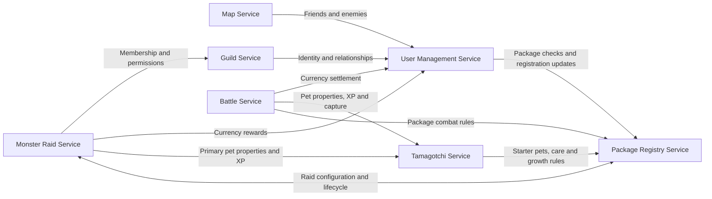
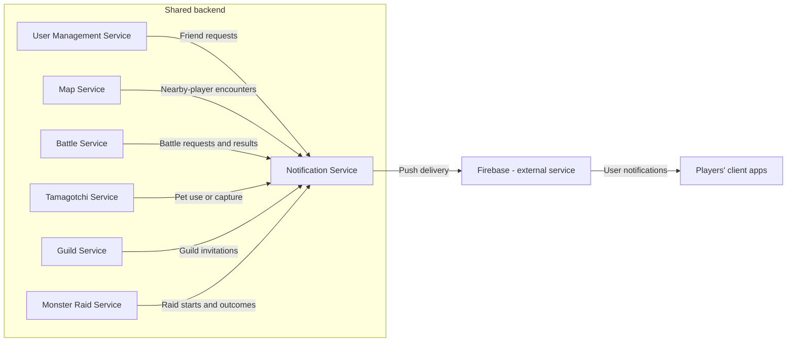

# Tamagotchi Go

Team 8's project for Distributed Applications Programming (PAD), Autumn 2026.

Tamagotchi Go is a shared backend for virtual-pet applications. Players care for pets, discover nearby players, fight turn-based battles, join guilds, and cooperate in monster raids. Creatures from different applications can participate in the same multiplayer ecosystem.

## Players, client apps, and packages

- **Client app:** the program a player uses to see their pet, perform care actions, view the map, battle, or chat. It sends actions to the backend and displays the results.
- **Package:** the registered identity and game configuration of one participating app. For example, a dragon app might use hunger and happiness, while a robot app uses energy and discipline. The Package Registry stores their definitions; it does not store or run the client application's code.
- **Backend:** the eight microservices below. They validate actions, own persistent game data, and coordinate shared gameplay. Clients request actions; they cannot award themselves currency, XP, or victories.

Package developers, represented by package moderators, configure their app's content and care rules. The brief imagines independently created clients but does not assign responsibility for building the course's demonstration client.

## Service boundaries

Each service is the authority for its own data. Other services request information or changes through the owning service instead of modifying its storage directly. A reference to a user, pet, package, or guild identifies the existing entity; it does not create another authoritative copy.

### 1. User Management Service

**Responsibility:** global user identity, social relationships, and user currency balances.

- Owns accounts, usernames, email addresses, authentication credentials, and global user privileges.
- Owns friend requests, friendships, and enemy relationships.
- Records which packages a user is registered with.
- Owns global currency balances and applies currency changes resulting from battles and raids.
- Proposed boundary: also owns local currency balances per user and package; their earning and spending rules remain package-specific.

**Boundary:** pet ownership and progression belong to Tamagotchi; guild membership belongs to Guild; package definitions belong to Package Registry. User Management validates and applies currency changes, while Battle and Monster Raid determine the rewards for their activities.

### 2. Tamagotchi Service

**Responsibility:** persistent pet identity, ownership, and progression.

- Owns each pet's identifier, originating package, owner, combat type, level, XP, and sprite references.
- Creates the user's initial primary pet from the chosen package's starter-pet configuration.
- Owns primary-pet assignments and references to secondary pets. Secondary pets refer to existing records and are never duplicated when acquired or selected.
- Stores and validates each pet's package-specific care statistics using the package's definitions. Hunger, energy, happiness, and other statistics retain their package-specific structures and meanings.
- Maintains the six predefined combat types and their type-advantage relationships. Their names and advantage cycle will be finalized with the game rules.
- Applies pet XP updates and ownership transfers requested after gameplay outcomes.

**Boundary:** this service owns persistent pet state, not a battle's temporary HP or turn counter. Package Registry defines care and growth rules; Battle interprets pet properties for PvP combat.

### 3. Battle Service

**Responsibility:** player-versus-player matches and turn-based combat.

- Proposed boundary: owns battle challenges, acceptance, and match creation, as well as the resulting battle session.
- Owns participants, selected primary and secondary pet references, equipped battle boosts, starting HP, current HP, turns, and battle results.
- Calculates damage from levels, type advantages, boosts, and the interpretation of package-specific care statistics.
- Determines winner and loser rewards and a defined XP split between primary and secondary pets.
- Coordinates settlement: User Management applies currency changes; Tamagotchi applies XP and transfers the loser's primary pet to the winner. The winner gains global currency and XP; the loser loses some global currency and receives less XP.

**Boundary:** Battle owns the combat result, but never directly edits currency balances or persistent pet records. Cooperative monster fights belong to Monster Raid.

### 4. Notification Service

**Responsibility:** asynchronous delivery of user notifications through Firebase push notifications.

- Receives events such as friend requests, nearby-player encounters, battle requests, pet use or capture, guild invitations, and raid starts.
- Owns client push-registration information and notification delivery records.
- Determines how an event becomes a notification and handles its delivery through Firebase.

**Boundary:** it delivers information about decisions made by other services. It does not detect proximity, accept invitations, calculate combat, or award rewards. Guild chat belongs to Guild.

### 5. Map Service

**Responsibility:** player locations and proximity detection.

- Owns each user's latest known coordinates and location timestamp, ignoring stale updates.
- Uses relationships from User Management to keep friends and enemies visible on the map.
- Detects unrelated users within the proximity threshold and produces encounter events that can suggest friendship or battle.

**Boundary:** Map reports encounters; Battle manages challenges and Notification delivers alerts. The brief suggests approximately `6(?)` meters, so the exact proximity threshold remains to be confirmed.

### 6. Monster Raid Service

**Responsibility:** active cooperative guild raids against a shared monster.

- Runs raid instances using the monster definitions, schedule, duration, participant limits, and reward configuration provided by Package Registry.
- Checks guild eligibility through Guild and primary-pet eligibility through Tamagotchi.
- Owns active monster HP, participants, damage contributions, action timestamps, the raid timer, and raid status.
- Processes repeated attack actions and determines victory or failure when the monster dies or time expires.
- Determines participant rewards and requests their application from User Management and Tamagotchi.

**Boundary:** live raid progress belongs here; editable monster definitions and scheduling configuration belong to Package Registry. Guild membership belongs to Guild, and persistent player rewards belong to their respective data owners.

### 7. Guild Service

**Responsibility:** guild organization and real-time communication between guild members.

- Owns guild identity, membership, invitations, roles, and permissions, including leaders, officers, and ordinary members.
- Owns guild chat messages, including their guild, author, and timestamp.
- Checks user identity and relationships through User Management when evaluating membership and invitation rules.
- Provides membership and permission information to Monster Raid.

**Boundary:** Guild decides who belongs to a guild and who may use guild features. Monster Raid manages the shared fight; User Management owns global friendships and enemy relationships.

### 8. Package Registry Service

**Responsibility:** participating app definitions and configurable game content.

- Owns package identifiers, names, versions, descriptions, status, and associated developers/moderators.
- Owns package-specific starter-pet configuration, care-statistic definitions, limits, growth mechanics, and interpretation rules such as thresholds for combat bonuses.
- Proposed boundary: owns configurable local-currency earning and spending rules; User Management owns the corresponding balances.
- Records user-package associations using registration information supplied by User Management.
- Allows globally privileged admins to configure monsters: names, descriptions, sprites, maximum HP, combat properties, weaknesses, resistances, and rewards.
- Owns raid scheduling configuration, including duration and participant limits, and requests activation, deactivation, or cancellation of raid instances from Monster Raid.

**Boundary:** Registry owns the definition of a statistic, not an individual pet's current value. It owns monster and raid configuration, not the live monster HP, attack history, or reward settlement of an active raid.

## Architecture and service communication

The two diagrams are complementary views of the same backend. The first shows domain-service dependencies; the second shows the Notification Service and external push delivery.

Arrows identify which service initiates a request or sends information to another service. A double arrow represents communication in both directions. These are logical relationships; transport choices and endpoint contracts will be defined in later Lab 0 requirements.

### Domain services

Client apps call the service responsible for the requested action: User Management for accounts and friendships, Tamagotchi for pets and care, Map for location, Battle for PvP, Guild for membership and chat, and Monster Raid for cooperative attacks. Developer/moderator and admin tools use Package Registry to configure content. Clients register for push delivery through Notification.

All protected actions use the user's authenticated identity. Repeated authentication dependencies are omitted from the diagram for readability. Reward settlement and pet-transfer operations are internal service responsibilities, not unrestricted client actions.

### Events and notification delivery

## Example flows

1. **Care for a pet:** the client sends a care action to Tamagotchi. Tamagotchi checks the package's rules through Package Registry, validates the action, and updates the pet's values. The client displays the resulting state.
2. **Discover another player:** the client sends location updates to Map. Map checks relationships through User Management and detects a nearby stranger. Notification receives the encounter event and delivers a push notification. A player can then initiate a challenge through Battle.
3. **Finish a PvP battle:** Battle determines the outcome using pet properties and package rules. It requests currency settlement from User Management and XP/ownership changes from Tamagotchi. Capturing a pet changes the existing record's ownership; it does not create another pet.
4. **Run a guild raid:** an admin configures and schedules a raid through Package Registry. Monster Raid starts the instance, checks membership through Guild, and retrieves primary-pet properties from Tamagotchi. It tracks attacks and the timer, then coordinates rewards through the owning services if the monster is defeated.

## Design assumptions to confirm

The brief leaves several boundaries open. This proposal uses the following assumptions so each kind of state has a clear owner:

| Point requiring clarification | Proposed boundary or open decision |
| --- | --- |
| Guild is told to use “Registry” for identity and relationships, while User Management explicitly owns those facts. | Guild uses User Management for identity and relationships. |
| User Management and Package Registry both record user-package registrations. | User Management owns registrations; Registry maintains a corresponding view for package administration. |
| Battle is described as starting after a match exists, without assigning challenge or match creation. | Battle also owns challenges, acceptance, and match creation. |
| Local currency rules vary by package. | User Management owns balances per user and package; Registry owns their configurable rules. |
| Packages can define different growth rates and combat-bonus thresholds. | Tamagotchi validates progression; Battle enforces shared combat limits; Registry validates package settings against those limits. Exact balance rules and limits remain to be agreed. |
| Losing a battle transfers the loser's primary pet. | Tamagotchi transfers the existing record. Rules for selecting a replacement primary pet and for the continued validity of secondary references remain to be agreed. |

Source: *FAF.PAD21.1 Autumn 2026, PAD_LAB_0_2026.pdf* — Lab 0 grading criteria, pages 2–4, and Topic 2: Tamagotchi Go, pages 8–11.
