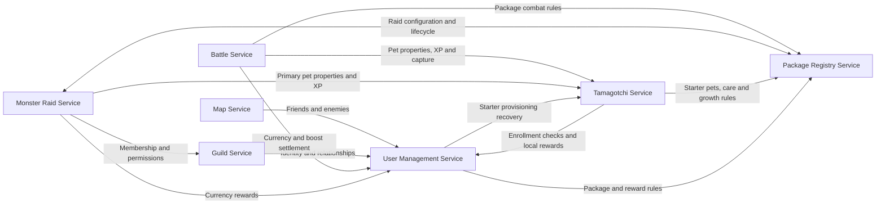
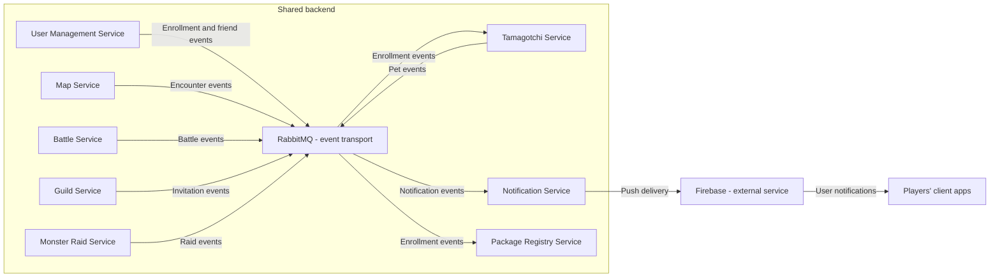

# Tamagotchi Go

Team 8's project for Distributed Applications Programming (PAD), Autumn 2026.

Tamagotchi Go is a shared backend for virtual-pet applications. Players care for pets, discover nearby players, fight turn-based battles, join guilds, and cooperate in monster raids. Creatures from different applications can participate in the same multiplayer ecosystem.

**Contents:** [Service boundaries](#service-boundaries) · [Architecture](#architecture-and-service-communication) · [Technologies](#technologies-and-communication-patterns-grade-5) · [Communication contract](#communication-contract-grade-6) · [Endpoint catalog](#http-endpoint-catalog) · [Field dictionary](#request-and-response-field-dictionary)

## Players, client apps, and packages

- **Client app:** the program a player uses to see their pet, perform care actions, view the map, battle, or chat. It sends actions to the backend and displays the results.
- **Package:** the registered identity and game configuration of one participating app. For example, a dragon app might use hunger and happiness, while a robot app uses energy and discipline. The Package Registry stores their definitions; it does not store or run the client application's code.
- **Backend:** the eight microservices below. They validate actions, own persistent game data, and coordinate shared gameplay. Clients request actions; they cannot award themselves currency, XP, or victories.

Package developers, represented by package moderators, configure their app's content and care rules. The brief imagines independently created clients but does not assign responsibility for building the course's demonstration client.

## Service boundaries

Each service is the authority for its own data. Other services request information or changes through the owning service instead of modifying its storage directly. A reference to a user, pet, package, or guild identifies the existing entity; it does not create another authoritative copy.

### 1. User Management Service

**Responsibility:** global user identity, social relationships, and user currency balances.

- Owns accounts, usernames, email addresses, authentication credentials, and global user privileges.
- Owns friend requests, friendships, and enemy relationships.
- Records which packages a user is registered with.
- Owns global currency balances and applies currency changes resulting from battles and raids.
- Owns available battle boosts and reserves/consumes them for Battle.
- Proposed boundary: also owns local currency balances per user and package; their earning and spending rules remain package-specific.

**Boundary:** pet ownership and progression belong to Tamagotchi; guild membership belongs to Guild; package definitions belong to Package Registry. User Management validates and applies currency changes, while Battle and Monster Raid determine the rewards for their activities.

### 2. Tamagotchi Service

**Responsibility:** persistent pet identity, ownership, and progression.

- Owns each pet's identifier, originating package, owner, combat type, level, XP, and sprite references.
- Creates the user's initial primary pet from the chosen package's starter-pet configuration.
- Owns primary-pet assignments and references to secondary pets. Secondary pets refer to existing records and are never duplicated when acquired or selected.
- Stores and validates each pet's package-specific care statistics using the package's definitions. Hunger, energy, happiness, and other statistics retain their package-specific structures and meanings.
- Maintains the six predefined combat types and their type-advantage relationships. The six types and advantage cycle are specified in the initial contract rules below.
- Applies pet XP updates and ownership transfers requested after gameplay outcomes.

**Boundary:** this service owns persistent pet state, not a battle's temporary HP or turn counter. Package Registry defines care and growth rules; Battle interprets pet properties for PvP combat.

### 3. Battle Service

**Responsibility:** player-versus-player matches and turn-based combat.

- Proposed boundary: owns battle challenges, acceptance, and match creation, as well as the resulting battle session.
- Owns participants, selected primary and secondary pet references, equipped battle boosts, starting HP, current HP, turns, and battle results.
- Calculates damage from levels, type advantages, boosts, and the interpretation of package-specific care statistics.
- Determines winner and loser rewards and a defined XP split between primary and secondary pets.
- Coordinates settlement: User Management applies currency changes; Tamagotchi applies XP and transfers the loser's primary pet to the winner. The winner gains global currency and XP; the loser loses some global currency and receives less XP.

**Boundary:** Battle owns the combat result, but never directly edits currency balances or persistent pet records. Cooperative monster fights belong to Monster Raid.

### 4. Notification Service

**Responsibility:** asynchronous delivery of user notifications through Firebase push notifications.

- Receives events such as friend requests, nearby-player encounters, battle requests, pet use or capture, guild invitations, and raid starts.
- Owns client push-registration information and notification delivery records.
- Determines how an event becomes a notification and handles its delivery through Firebase.

**Boundary:** it delivers information about decisions made by other services. It does not detect proximity, accept invitations, calculate combat, or award rewards. Guild chat belongs to Guild.

### 5. Map Service

**Responsibility:** player locations and proximity detection.

- Owns each user's latest known coordinates and location timestamp, ignoring stale updates.
- Uses relationships from User Management to keep friends and enemies visible on the map.
- Detects unrelated users within the proximity threshold and produces encounter events that can suggest friendship or battle.

**Boundary:** Map reports encounters; Battle manages challenges and Notification delivers alerts. The brief suggests approximately `6(?)` meters; contract version 1.0.0 uses 6 meters, subject to professor confirmation.

### 6. Monster Raid Service

**Responsibility:** active cooperative guild raids against a shared monster.

- Runs raid instances using the monster definitions, schedule, duration, participant limits, and reward configuration provided by Package Registry.
- Checks guild eligibility through Guild and primary-pet eligibility through Tamagotchi.
- Owns active monster HP, participants, damage contributions, action timestamps, the raid timer, and raid status.
- Processes repeated attack actions and determines victory or failure when the monster dies or time expires.
- Determines participant rewards and requests their application from User Management and Tamagotchi.

**Boundary:** live raid progress belongs here; editable monster definitions and scheduling configuration belong to Package Registry. Guild membership belongs to Guild, and persistent player rewards belong to their respective data owners.

### 7. Guild Service

**Responsibility:** guild organization and real-time communication between guild members.

- Owns guild identity, membership, invitations, roles, and permissions, including leaders, officers, and ordinary members.
- Owns guild chat messages, including their guild, author, and timestamp.
- Checks user identity and relationships through User Management when evaluating membership and invitation rules.
- Provides membership and permission information to Monster Raid.

**Boundary:** Guild decides who belongs to a guild and who may use guild features. Monster Raid manages the shared fight; User Management owns global friendships and enemy relationships.

### 8. Package Registry Service

**Responsibility:** participating app definitions and configurable game content.

- Owns package identifiers, names, versions, descriptions, status, and associated developers/moderators.
- Owns package-specific starter-pet configuration, care-statistic definitions, limits, growth mechanics, and interpretation rules such as thresholds for combat bonuses.
- Proposed boundary: owns configurable local-currency earning and spending rules; User Management owns the corresponding balances.
- Records user-package associations using registration information supplied by User Management.
- Allows globally privileged admins to configure monsters: names, descriptions, sprites, maximum HP, combat properties, weaknesses, resistances, and rewards.
- Owns raid scheduling configuration, including duration and participant limits, and requests activation, deactivation, or cancellation of raid instances from Monster Raid.

**Boundary:** Registry owns the definition of a statistic, not an individual pet's current value. It owns monster and raid configuration, not the live monster HP, attack history, or reward settlement of an active raid.

## Architecture and service communication

The two diagrams are complementary views of the same backend. The first shows domain-service dependencies; the second shows the Notification Service and external push delivery.

Arrows identify which service initiates a request or sends information to another service. A double arrow represents communication in both directions. The language, transport and endpoint choices for these relationships are defined in the Grade 5 and Grade 6 sections below.

### Domain services



Client apps call the service responsible for the requested action: User Management for accounts and friendships, Tamagotchi for pets and care, Map for location, Battle for PvP, Guild for membership and chat, and Monster Raid for cooperative attacks. Developer/moderator and admin tools use Package Registry to configure content. Clients register for push delivery through Notification.

All protected actions use the user's authenticated identity. Repeated authentication dependencies are omitted from the diagram for readability. Reward settlement and pet-transfer operations are internal service responsibilities, not unrestricted client actions.

### Events and notification delivery



## Example flows

1. **Care for a pet:** the client sends a care action to Tamagotchi. Tamagotchi checks the package's rules through Package Registry, validates the action, and updates the pet's values. The client displays the resulting state.
2. **Discover another player:** the client sends location updates to Map. Map checks relationships through User Management and detects a nearby stranger. Notification receives the encounter event and delivers a push notification. A player can then initiate a challenge through Battle.
3. **Finish a PvP battle:** Battle determines the outcome using pet properties and package rules. It requests currency settlement from User Management and XP/ownership changes from Tamagotchi. Capturing a pet changes the existing record's ownership; it does not create another pet.
4. **Run a guild raid:** an admin configures and schedules a raid through Package Registry. Monster Raid starts the instance, checks membership through Guild, and retrieves primary-pet properties from Tamagotchi. It tracks attacks and the timer, then coordinates rewards through the owning services if the monster is defeated.

## Design assumptions to confirm

The brief leaves several boundaries open. This proposal uses the following assumptions so each kind of state has a clear owner:

| Point requiring clarification | Proposed boundary or open decision |
| --- | --- |
| Guild is told to use “Registry” for identity and relationships, while User Management explicitly owns those facts. | Guild uses User Management for identity and relationships. |
| User Management and Package Registry both record user-package registrations. | User Management owns registrations; Registry maintains a corresponding view for package administration. |
| Battle is described as starting after a match exists, without assigning challenge or match creation. | Battle also owns challenges, acceptance, and match creation. |
| Local currency rules vary by package. | User Management owns balances per user and package; Registry owns their configurable rules. |
| Packages can define different growth rates and combat-bonus thresholds. | Tamagotchi validates progression; Battle enforces shared combat limits; Registry validates package settings against those limits. The initial game rules below specify the selected limits for contract version 1.0.0. |
| Losing a battle transfers the loser's primary pet. | Tamagotchi transfers the existing record. The winner keeps their primary; the loser must select another owned pet. Ownership changes remove the old owner's secondary reference. These rules are specified below. |

## Technologies and communication patterns (Grade 5)

The team uses **Go and TypeScript**. These are the selected design choices for implementation in later labs; this repository currently contains documentation and contracts.

| Service | Language and HTTP framework | Storage | Communication |
| --- | --- | --- | --- |
| User Management | TypeScript, Node.js, Fastify | PostgreSQL `users` database | HTTP/JSON accounts, relationships and settlement; publishes enrollment/friend events |
| Tamagotchi | Go, `net/http` | PostgreSQL `pets` database; JSONB for package-local statistics | HTTP/JSON care, reservations and pet settlement; consumes enrollment events; publishes pet events |
| Battle | Go, `net/http` | PostgreSQL `battles` database | HTTP/JSON challenges, turns, dependency requests and result polling; publishes battle events |
| Notification | TypeScript, Node.js, Fastify | PostgreSQL `notifications` database | HTTP/JSON device registration; consumes RabbitMQ events; Firebase Cloud Messaging push |
| Map | Go, `net/http` | PostgreSQL `locations` database | HTTP/JSON location updates and map queries; reads relationships; publishes encounter events |
| Monster Raid | Go, `net/http` | PostgreSQL `raids` database | HTTP/JSON scheduling commands, joins, attacks and result polling; publishes raid events |
| Guild | TypeScript, Node.js, Fastify | PostgreSQL `guilds` database | HTTP/JSON membership/history; WebSocket chat; publishes invitation events |
| Package Registry | TypeScript, Node.js, Fastify | PostgreSQL `registry` database; JSONB for configuration | HTTP/JSON configuration and scheduler commands; consumes enrollment events |

Go is our choice for game-state services and concurrent location/attack requests. TypeScript is our choice for account, configuration and notification APIs, with shared typed request definitions helping those services evolve together. The cost of two languages is maintaining equivalent validation and serialization; the language-independent contract below is the shared reference. Go's HTTP library and Fastify provide the HTTP foundations. [Go HTTP documentation](https://pkg.go.dev/net/http), [Fastify documentation](https://fastify.dev/docs/latest/).

PostgreSQL provides local transactions for balances, ownership and combat state. JSONB preserves differently named package statistics and supports querying them; it does not require every package to have the same pet-care fields. Separate databases give clear ownership at the cost of cross-service consistency work. For a lab deployment, the databases may share one PostgreSQL server, with separate credentials and no cross-service table access. [PostgreSQL JSON documentation](https://www.postgresql.org/docs/current/datatype-json.html).

HTTP with UTF-8 JSON keeps interfaces easy to inspect from both languages and from custom client apps. Synchronous requests handle immediate decisions such as checking membership or reserving pets. The trade-off is dependency latency and failure; calls have a two-second timeout, and failed operations remain visible for retry. Clients poll battle/raid resources for state; guild chat uses WebSockets because it needs continuous delivery and therefore requires reconnect and history-replay handling.

RabbitMQ carries domain events through a durable topic exchange named `tamagotchi.events`; routing keys are the event types listed below. Each consuming service has its own durable queue so Notification and Registry do not compete for the same event. This separates notification delivery and registration projections from gameplay requests, at the cost of duplicate-message handling and eventually consistent views. Producers use persistent messages, an outbox and publisher confirms; consumers acknowledge after durable processing. These mechanisms still permit redelivery. [RabbitMQ reliability guide](https://www.rabbitmq.com/docs/reliability).

Firebase Cloud Messaging is the required push provider. Notification sends a short notification plus string-valued data containing `eventId`, `type` and `targetId`; the client fetches authoritative state after opening it. Full battle objects and credentials are never put into a push payload. [Firebase message types](https://firebase.google.com/docs/cloud-messaging/customize-messages/set-message-type).

## Communication contract (Grade 6)

Contract version: **1.0.0**. This is the proposed complete interface for the scope above, not a claim that the endpoints are already running.

- [HTTP API: OpenAPI 3.1.1](contracts/openapi.yaml) defines every path, parameter, request, response, field type and caller restriction.
- [Broker event JSON Schema](contracts/events.schema.json) defines the ten event envelopes and payloads.
- [Guild WebSocket JSON Schema](contracts/realtime.schema.json) defines the six application-frame types.
- The endpoint catalog, field dictionary and flows below are the readable form of the same contract. Named types in the tables are defined in the field dictionary and the schema files.

OpenAPI describes HTTP interfaces independently of their implementation language. Versioned JSON Schema documents cover the non-HTTP messages. [OpenAPI specification](https://spec.openapis.org/oas/v3.1.1.html).

### Common request and response rules

| Item | Contract |
| --- | --- |
| Addressing | Paths are relative to the owning service's origin. There is no assumed API gateway. Public application paths start with `/v1`; internal paths start with `/internal/v1`. |
| Serialization | Request and response bodies use `application/json`, UTF-8, camelCase field names. Unlisted object fields are rejected except in explicitly defined maps. |
| Identifiers | IDs are UUID strings, not numbers. All path placeholders ending in `Id` are UUIDs. `configVersion`, `monsterVersion`, `rulesVersion` and `scheduleVersion` path parameters are positive integers. |
| Numbers | Currency is whole units in the range 0–9,007,199,254,740,991; arithmetic cannot exceed that range. JSON integers and numbers remain distinct in the schemas. Coordinates are degrees; distances are meters. |
| Time | RFC 3339 UTC strings, such as `2026-09-09T10:00:00Z`. Game timers, care progression and action cooldowns use server time. |
| Required/nullable | Fields are required unless marked `?` in the dictionary. `T or null` requires the key but permits a null value. An omitted request body is shown as `—`. |
| User authentication | `Authorization: Bearer <accessToken>`. User Management signs RS256 JWTs; services validate signature, trusted issuer, audience `tamagotchi-go`, subject and expiry using its public JWKS. JWTs last 15 minutes. Refresh tokens are opaque, hashed in storage, rotated on refresh and valid for at most 30 days. Logout revokes the refresh session; already issued access tokens expire normally. |
| Roles | `player` means an authenticated user with resource-specific ownership/membership checks. `admin` requires the global admin role. `moderator/admin` permits a moderator assigned to that package or a global admin. Initial admin provisioning is a deployment/bootstrap task; clients cannot grant themselves roles. |
| Service authentication | `internal` routes require mutual TLS plus the per-endpoint caller allowlist in OpenAPI. Player tokens alone cannot call them. Public read-only package/rule routes also serve internal readers. User-context calls may forward the originating user's JWT without enlarging its permissions. |
| Idempotency | Every business mutation requires a UUID `Idempotency-Key`, except authentication and timestamp-based location updates. The owning service scopes it by authenticated caller, method and path, and stores the request hash and outcome. Same key/input replays the outcome; changed input returns `409`. Ordinary keys are retained for at least 24 hours. Settlement/provisioning resource IDs and their uniqueness records are retained permanently. |
| Concurrency | `expectedVersion` and `expectedTurn` reject stale changes with `409`. Database transactions serialize balance changes, pet reservations and raid HP updates. Raid attacks use one key per click, without a shared client-side version precondition. |
| Pagination | Routes marked as paginated accept optional `cursor:string` and `limit:integer` (1–100, default 20). Return `{items:[T], nextCursor:string or null}`. Cursors are opaque and bound to the caller/filter. Chat history instead uses `afterSequence` and `hasMore`. |
| Success | The endpoint table gives the status and body type. `204` has no body. `202` acknowledges work still in progress; clients poll the returned battle's GET endpoint. `101` is a WebSocket upgrade, not JSON. |
| Failure | `400` malformed input; `401` unauthenticated; `403` forbidden; `404` absent/inaccessible resource; `409` conflict; `422` invalid domain values; `429` rate/cooldown limit; `503` unavailable dependency. Each uses the `Error` body. Validation and authorization failures have no effect. A timeout or `503` can follow accepted work: retry with the same key and inspect its state. |
| Retries | Retry reads on transient failure with bounded backoff. After a timeout on a mutation, retry the exact operation with the same key; never assume it failed. Scheduled coordinators retain unresolved work durably instead of making clients resubmit it as a new action. |
| Evolution | Additive optional fields may be introduced compatibly. Breaking HTTP changes get `/v2`; breaking events get a new type suffix and schema version. Care/configuration and combat-rule revisions are immutable snapshots, independent of API version. |

Example: `POST /v1/pets/{petId}/care`, with a user bearer token and an `Idempotency-Key`:

```json
{"actionId":"feed","expectedVersion":3}
```

An unsuccessful version check returns `409`:

```json
{
  "error": {
    "code": "VERSION_CONFLICT",
    "message": "Refresh the pet before performing another action.",
    "requestId": "00000000-0000-4000-8000-000000000001",
    "details": [{"field":"expectedVersion","reason":"Current version is 4."}]
  }
}
```

### Data ownership and consistency

| Owner | Authoritative data and local atomic operations | Data obtained from other owners |
| --- | --- | --- |
| User Management | Accounts, refresh sessions, friendships/enemies, user-package enrollments, global/local currency, boost inventory, holds and reward ledger | Active package/configuration, pinned combat rules and raid reward configuration |
| Tamagotchi | Pet records, primary/secondary references, care progression, XP, exclusive reservations and ownership transfers | Canonical enrollment, immutable package rules and gameplay reward configuration |
| Battle | Challenges, loadouts, frozen inputs, turn/HP state, outcome and settlement progress | Reserved pets, package rules, wallet/boost holds |
| Notification | Device tokens, notification records and event deduplication | Validated domain events; Firebase delivery responses |
| Map | Latest location per user, timestamp and encounter state | Public profiles and current relationships |
| Monster Raid | Active instance, participant reservations, HP/damage/timer and reward progress | Pinned monster/schedule, current guild eligibility and frozen pet properties |
| Guild | Guilds, invitations, member roles, chat messages and per-guild message sequence | User identity and relationships |
| Package Registry | Package/moderator definitions, immutable care rules, global rule versions, monsters and schedules | A read-only enrollment projection from User Management |

Each database has its own credentials. There are no cross-database writes or foreign keys: service-owned IDs cross the API boundary, and the owner validates them. User Management is authoritative for enrollment; Registry's copy is a projection and may lag. Private credentials and device tokens stay in their owning service.

For event publication, the service writes its business update and outbox record in one local transaction. A worker publishes the outbox message with the same `eventId` until confirmed. Consumers record processed event IDs in an inbox with their local changes before acknowledging. Updates to the same projected entity also compare `aggregateVersion`; older revisions cannot overwrite newer ones. Validation/processing failures are retried with backoff and then retained in a dead-letter queue for inspection and replay. Notification creates one durable record per event/recipient. Firebase delivery can still repeat after an uncertain provider response, so clients deduplicate by event ID.

Cross-service workflows have **eventual completion, not a single distributed database transaction**:

1. **Enrollment and starter pets:** registration/enrollment commits in User Management and emits `user.package-registered.v1`. Registry records the projection; Tamagotchi verifies the canonical enrollment and provisions exactly one starter per `(userId, packageId)`. The first starter becomes primary; a starter from another enrolled package becomes an owned secondary reference. Re-enrolling does not grant another pet. Until the event is processed, `GET /v1/pets` may return an empty roster.
2. **Care rewards:** Tamagotchi stores the validated action, pet update and a durable currency-settlement task together. It calls User Management's local-reward endpoint with the action instance ID. User Management reads the pinned action rule and independently enforces the daily currency cap. `CareResult.localRewardStatus` remains pending/blocked until that one operation settles; retrying the care request does not apply stat changes twice. Poll `/v1/care-actions/{operationId}` using the returned `actionInstanceId`; it returns the original pet snapshot with current settlement progress.
3. **Starting a battle:** Battle validates participants, then requests one atomic currency/boost reservation for both users and one atomic pet reservation for all four pets. Only then may combat start. A failed preparation releases successful holds before cancelling. Pet holds are exclusive: care, primary changes, other battles and raids cannot mutate/use a held pet. Each service enforces uniqueness locally. Holds are durable and released explicitly, not automatically expired during a live or settling match.
4. **Finishing a battle:** Battle persists the result before requesting wallet and pet settlement with the battle ID. User Management atomically transfers the stake and consumes reserved boosts. Tamagotchi atomically assigns XP to the four reserved pets, transfers the loser's original primary record and releases its holds. Each owner accepts only the coordinator and validates the result against its reservation. Battle reports `settling` until both owners acknowledge; after completion it emits `battle.finished.v1`. Partial success is retried with the same IDs; the winning side's already applied reward is never repeated or reversed by a network timeout. Permanently failing work is reported as `blocked` for repair.
5. **Raids:** Registry durably dispatches a due schedule using `raidId = scheduleId`. Monster Raid records the instance once and pins the configuration. Each successful join reserves the member's primary with a distinct persisted reservation ID; interrupted joins are retried or compensated. Attacks validate current membership, timer and cooldown, then update HP atomically. Victory records the eligible contributor list once; User Management settles currency once per raid and Tamagotchi settles XP/releases once per participant reservation. Failed/cancelled raids release holds without rewards. Completion events follow settlement. The first terminal decision wins when cancellation, expiry and the final attack race.

Schedule changes are versioned. Registry retries dispatch/cancellation with stable operation IDs and reads the same version after an uncertain result. Cancellation records a tombstone even if a delayed start has not arrived, preventing a cancelled raid from starting later. An inactive schedule may be reactivated only if no start/cancellation has been dispatched; otherwise create a new schedule. Once victory settlement begins, cancellation returns `409`. A schedule's `dispatchStatus` describes command delivery, while the Raid resource describes actual gameplay.

### Initial game rules used by the contracts

These are team design decisions for contract version 1.0.0; the numerical values are not prescribed by the lab PDF.

- Types follow `flame → nature → earth → electric → water → shadow → flame`. Attacking the next type gives `1.5×`; attacking the previous type gives `0.75×`; other pairings give `1×`. Battle uses primary types; secondary levels contribute to damage and starting HP.
- Combat rules version 1: stake **10 global coins** per player; the winner gains 10 and the loser loses 10. Reservations require both to have enough available currency. Accounts start with zero coins and can earn their first coins in a raid. Each account receives one `power` boost; choosing it gives +10% damage and consumes it on completed battle settlement. At most one boost is equipped. Package moderators cannot grant boosts or global currency.
- Winner pet XP is **100**, loser pet XP is **40**, split **60% primary / 40% secondary** before any ownership transfer. Pet XP is cumulative; `level = min(100, 1 + floor(xp / 100))`. At level 100, additional XP may be recorded but gives no extra combat level. Care earns at most 10 XP per action and 100 XP per pet per UTC day. Local currency earns at most 100 units per user/package per UTC day; attempts beyond that cap settle with a zero grant.
- Package statistics remain in their original units. Each satisfied threshold produces its configured bonus; each pet's total care bonus is capped at 10%. A battle uses the average bonus of the primary and secondary. Starting HP is `100 + 10 * primaryLevel + 5 * secondaryLevel`. Attack damage is `max(1, floor((2 * primaryLevel + secondaryLevel) * typeMultiplier * (1 + (careBonus + boostBonus) / 100)))`. Only the acting player's frozen properties are used; clients submit an action, never damage or XP.
- A challenge expires after five minutes. Turns have a 30-second deadline; the challenger starts. A timeout or forfeit awards the opponent victory. Accept/decline/cancel transitions use a local compare-and-set so only one succeeds.
- Both battle pets must already exist, be different, belong to the player, and match the current primary/secondary assignment. A player can obtain a second starter by enrolling in another active package. Capture preserves the pet's original package/configuration. The winner keeps their existing primary; the captured pet becomes an owned secondary. The loser has no selected primary until choosing another owned pet. Secondary references owned by the loser no longer include the captured pet.
- Package versions cannot rewrite a running battle or raid. New configurations apply to newly created pets; explicit migration is future work. Package publication validates stat bounds, known stat names in care actions, positive cooldowns and global bonus/XP limits. Only global admins may activate packages and configure raids. Suspended packages cannot enroll users or start new care/combat actions; already running activities finish against their snapshots.
- A raid member may attack once per second. Each attack deals `max(1, floor(2 * primaryLevel * monsterMultiplier * (1 + careBonus / 100)))`: weakness `1.5×`, resistance `0.75×`, otherwise `1×`; a type cannot be both. The `armored` special property halves that result, rounded down with a minimum of one. Monster `baseAttack` is configuration metadata; this initial clicker contract has no counterattack action. Raid boosts are not enabled. On victory, each participant with positive recorded damage receives the configured per-participant reward, even if they later leave the guild; departed members cannot submit more attacks.
- Map proximity is **6 meters** for strangers. A location is fresh for 120 seconds. Stale incoming updates never replace newer ones. Friends/enemies remain listed with their last known or null location; no fresh nearby claim is made for stale data. An encounter is emitted once on entry for an unordered pair and can recur after exit and re-entry. Guilds allow at most 100 members in this initial contract.

### HTTP endpoint catalog

Every path parameter is required. Every listed JSON request body is required. GET and bodyless actions use only their path, query, authentication and applicable idempotency header. The success column gives the complete named response shape; all routes share the error responses above. Caller-specific restrictions are also present in OpenAPI.

#### User Management endpoints

| Method and path | Caller | Input body / query | Success response | Purpose |
| --- | --- | --- | --- | --- |
| `POST /v1/auth/register` | public | `Register` | `201` `Session` | Validate an active package; create account/enrollment atomically. Grant one initial power boost per account. Publish enrollment for Registry and starter provisioning. New accounts have zero currency and must earn a raid reward before staking a PvP battle. |
| `POST /v1/auth/login` | public | `Login` | `200` `Session` | Create a session |
| `POST /v1/auth/refresh` | public | `Refresh` | `200` `Session` | Rotate the refresh token |
| `POST /v1/auth/logout` | public | `Refresh` | `204` empty | Revoke the refresh session |
| `GET /.well-known/jwks.json` | public | — | `200` `JWKS` | Read public token verification keys |
| `GET /v1/users/me` | player | — | `200` `User` | Read your private profile |
| `PATCH /v1/users/me` | player | `ProfileUpdate` | `200` `User` | Update your public username |
| `GET /v1/users/{userId}` | player | — | `200` `PublicUser` | Read a public user profile |
| `PUT /v1/users/me/packages/{packageId}` | player | — | `200` `Enrollment` | Unique user/package pair. Publishes user.package-registered.v1 for Registry and Tamagotchi. Repeated enrollment does not create another starter. |
| `POST /v1/friend-requests` | player | `FriendRequestInput` | `201` `FriendRequest` | Send a friend request |
| `GET /v1/friend-requests` | player | —; query: `cursor?: string`, `limit?: integer` | `200` `FriendRequestPage` | List your sent and received requests |
| `PUT /v1/friend-requests/{requestId}/decision` | player | `RequestDecision` | `200` `FriendRequest` | Only the recipient may decide. Acceptance creates mutual friendship atomically and removes enemy markers for this pair. |
| `DELETE /v1/friend-requests/{requestId}` | player | — | `204` empty | Sender only; atomically changes pending to cancelled. |
| `DELETE /v1/friends/{userId}` | player | — | `204` empty | Remove a mutual friendship |
| `GET /v1/relationships` | player | —; query: `cursor?: string`, `limit?: integer` | `200` `RelationshipPage` | List your friends and enemies |
| `PUT /v1/enemies/{userId}` | player | — | `200` `Relationship` | Directed enemy relationship; removes an existing mutual friendship atomically. Self-relations are rejected. |
| `DELETE /v1/enemies/{userId}` | player | — | `204` empty | Remove your enemy marker |
| `GET /v1/wallet` | player | — | `200` `Wallet` | Read your currencies and available boosts |
| `GET /internal/v1/relationships` | internal | —; query: `userId: ID`, `otherUserId: ID` | `200` `Relationship` | Read a relationship for another service |
| `GET /internal/v1/users/{userId}/relationships` | internal | —; query: `cursor?: string`, `limit?: integer` | `200` `RelationshipPage` | List user relationships for map visibility |
| `GET /internal/v1/users/{userId}/packages/{packageId}` | internal | — | `200` `Enrollment` | Verify canonical package enrollment |
| `PUT /internal/v1/battle-holds/{battleId}` | internal | `BattleHoldInput` | `200` `Hold` | Reserve both stakes and chosen boosts |
| `DELETE /internal/v1/battle-holds/{battleId}` | internal | — | `204` empty | Release an aborted battle reservation |
| `PUT /internal/v1/battle-settlements/{battleId}` | internal | `BattleMoneyResult` | `200` `WalletResult` | Apply battle currency transfer and consume boosts |
| `PUT /internal/v1/raid-settlements/{raidId}` | internal | `RaidMoneyInput` | `200` `WalletResult` | Apply raid currency rewards |
| `PUT /internal/v1/local-rewards/{operationId}` | internal | `LocalRewardInput` | `200` `LocalRewardResult` | Apply one validated care-action currency reward |

#### Tamagotchi endpoints

| Method and path | Caller | Input body / query | Success response | Purpose |
| --- | --- | --- | --- | --- |
| `GET /v1/pets` | player | — | `200` `PetRoster` | Read your owned pets and active primary |
| `GET /v1/pets/{petId}` | player | — | `200` `Pet` | Only the current owner. Battle/Raid use reserved snapshots instead of this player endpoint. |
| `PUT /v1/pets/primary` | player | `PrimaryInput` | `200` `PetRoster` | Select your primary pet |
| `POST /v1/pets/{petId}/care` | player | `CareInput` | `200` `CareResult` | Owner only. Reject reserved pets. Validate action against the pinned package configuration, elapsed server time, cooldown and daily XP/currency caps. |
| `GET /v1/care-actions/{operationId}` | player | — | `200` `CareResult` | Only the user who performed the action. operationId is the returned actionInstanceId; the pet snapshot is the original action result and settlement status may advance. |
| `GET /v1/pet-types` | player | — | `200` `TypeCatalog` | Read the six combat types and advantage cycle |
| `PUT /internal/v1/starter-pets/{operationId}` | internal | `StarterInput` | `200` `Pet` | operationId identifies a provisioning attempt/replay; uniqueness is enforced by userId/packageId as well. Set primary only if the user has none. The same logic handles the enrollment event. |
| `PUT /internal/v1/pet-reservations/{activityId}` | internal | `PetReserveInput` | `200` `PetReservation` | Reserve pets and return frozen combat properties |
| `DELETE /internal/v1/pet-reservations/{activityId}` | internal | — | `204` empty | Release unused pets without rewards |
| `PUT /internal/v1/pet-battle-settlements/{battleId}` | internal | `PetBattleResult` | `200` `PetResult` | Apply XP, transfer the loser primary and release pets |
| `PUT /internal/v1/pet-raid-settlements/{activityId}` | internal | `PetRaidResult` | `200` `PetResult` | Apply raid pet reward and release the primary |

#### Battle endpoints

| Method and path | Caller | Input body / query | Success response | Purpose |
| --- | --- | --- | --- | --- |
| `POST /v1/battles` | player | `BattleCreate` | `201` `Battle` | Challenge another player |
| `GET /v1/battles` | player | —; query: `cursor?: string`, `limit?: integer` | `200` `BattlePage` | List your battles |
| `GET /v1/battles/{battleId}` | player | — | `200` `Battle` | Read battle progress and settlement |
| `POST /v1/battles/{battleId}/accept` | player | `BattleAccept` | `202` `Battle` | Opponent only. Returns preparing while dependencies reserve resources. Starts combat only after all holds succeed; on failure compensates reservations and cancels. |
| `POST /v1/battles/{battleId}/decline` | player | — | `200` `Battle` | Opponent only, pending status only. |
| `DELETE /v1/battles/{battleId}` | player | — | `204` empty | Challenger only, before preparation/active combat. |
| `POST /v1/battles/{battleId}/actions` | player | `BattleAction` | `200` `Battle` | Attack or forfeit |

#### Notification endpoints

| Method and path | Caller | Input body / query | Success response | Purpose |
| --- | --- | --- | --- | --- |
| `PUT /v1/notification-devices/{deviceId}` | player | `DeviceInput` | `200` `Device` | Register or refresh your push device |
| `DELETE /v1/notification-devices/{deviceId}` | player | — | `204` empty | Remove your push device |
| `GET /v1/notifications` | player | —; query: `cursor?: string`, `limit?: integer` | `200` `NotificationPage` | List your notifications |
| `PUT /v1/notifications/{notificationId}/read` | player | — | `200` `Notification` | Mark your notification as read |

#### Map endpoints

| Method and path | Caller | Input body / query | Success response | Purpose |
| --- | --- | --- | --- | --- |
| `PUT /v1/map/location` | player | `LocationInput` | `200` `LocationResult` | Ignore recordedAt <= stored timestamp. Reject timestamps more than 30 seconds in the future. Only authenticated user location can be updated. |
| `GET /v1/map/nearby` | player | —; query: `cursor?: string`, `limit?: integer` | `200` `MapEntryPage` | Unknown users require fresh locations from both users, within 6 meters. Friends/enemies remain listed with stale or null locations. Map computes distance; the client cannot set the detection threshold. |

#### Monster Raid endpoints

| Method and path | Caller | Input body / query | Success response | Purpose |
| --- | --- | --- | --- | --- |
| `PUT /internal/v1/raids/{raidId}` | internal | `RaidStart` | `200` `Raid` | raidId must equal scheduleId. Fetch and pin the schedule and monster configuration. Reject early starts and inactive/cancelled schedules. One instance per schedule. |
| `DELETE /internal/v1/raids/{raidId}` | internal | — | `204` empty | Idempotently record a cancellation tombstone even if start has not arrived; reject later starts. If already won/settling after victory, return 409 and retain the result. Cancellation rewards nobody. |
| `GET /v1/raids` | player | —; query: `guildId: ID`, `cursor?: string`, `limit?: integer` | `200` `RaidPage` | Caller must currently belong to the guild. |
| `GET /v1/raids/{raidId}` | player | — | `200` `Raid` | Current guild members and recorded participants may view results. |
| `POST /v1/raids/{raidId}/participants` | player | `RaidJoin` | `201` `RaidParticipant` | Join using your primary pet |
| `POST /v1/raids/{raidId}/attacks` | player | — | `200` `Raid` | No body: caller identity, path and Idempotency-Key identify the attack. Require current guild eligibility, active timer and a one-second per-user cooldown. Compute damage on the server and update HP/version atomically; simultaneous participants do not submit a shared expectedVersion. |

#### Guild endpoints

| Method and path | Caller | Input body / query | Success response | Purpose |
| --- | --- | --- | --- | --- |
| `POST /v1/guilds` | player | `GuildInput` | `201` `Guild` | Create a guild and become leader |
| `GET /v1/guilds` | player | —; query: `cursor?: string`, `limit?: integer` | `200` `GuildPage` | List guilds you belong to |
| `GET /v1/guilds/{guildId}` | player | — | `200` `Guild` | Read a guild you belong to |
| `PATCH /v1/guilds/{guildId}` | player | `GuildInput` | `200` `Guild` | Leader or officer only. |
| `GET /v1/guilds/{guildId}/members` | player | —; query: `cursor?: string`, `limit?: integer` | `200` `MemberPage` | List guild members |
| `POST /v1/guilds/{guildId}/invitations` | player | `FriendRequestInput` | `201` `GuildInvite` | Leader/officer only; reject enemy relationship in either direction. |
| `GET /v1/guild-invitations` | player | —; query: `cursor?: string`, `limit?: integer` | `200` `GuildInvitePage` | List your received guild invitations |
| `PUT /v1/guild-invitations/{invitationId}/decision` | player | `RequestDecision` | `200` `GuildInvite` | Recipient only. Acceptance creates membership atomically. A user may belong to multiple guilds. |
| `DELETE /v1/guild-invitations/{invitationId}` | player | — | `204` empty | Leader or officer of the invitation guild only; atomically changes pending to revoked. |
| `PUT /v1/guilds/{guildId}/members/{userId}/role` | player | `RoleInput` | `200` `Member` | Leader only; target must be an existing non-leader member. |
| `PUT /v1/guilds/{guildId}/leader` | player | `LeaderInput` | `200` `Guild` | Current leader only. Demote previous leader to officer atomically. |
| `DELETE /v1/guilds/{guildId}/members/{userId}` | player | — | `204` empty | Self may leave unless leader. Leader can remove officers/members; officers can remove ordinary members. A leader must transfer leadership first. End removed member chat access. |
| `GET /v1/guilds/{guildId}/messages` | player | —; query: `afterSequence?: integer`, `limit?: integer` | `200` `ChatHistory` | Replay guild chat history |
| `GET /v1/guilds/{guildId}/chat` | public | — | `101` upgrade | Upgrade has no JSON body. First application frame must be ChatAuthenticate within 5 seconds; no messages/data are permitted before authentication and membership checks. See realtime.schema.json and README. |
| `GET /internal/v1/guilds/{guildId}/members/{userId}/eligibility` | internal | — | `200` `Eligibility` | Check current raid eligibility |
| `GET /internal/v1/guilds/{guildId}/members` | internal | —; query: `cursor?: string`, `limit?: integer` | `200` `MemberPage` | Read guild members for raid announcements |

#### Package Registry endpoints

| Method and path | Caller | Input body / query | Success response | Purpose |
| --- | --- | --- | --- | --- |
| `POST /v1/packages` | admin | `PackageInput` | `201` `Package` | Register a participating app |
| `GET /v1/packages` | public | —; query: `cursor?: string`, `limit?: integer` | `200` `PackagePage` | List active packages |
| `GET /v1/packages/{packageId}` | public | — | `200` `Package` | Read package metadata |
| `PATCH /v1/packages/{packageId}` | moderator/admin | `PackageUpdate` | `200` `Package` | Update package metadata or status |
| `PUT /v1/packages/{packageId}/moderators/{userId}` | admin | — | `200` `Package` | Assign a package moderator |
| `DELETE /v1/packages/{packageId}/moderators/{userId}` | admin | — | `204` empty | Remove a package moderator |
| `POST /v1/packages/{packageId}/configurations` | moderator/admin | `PackageConfigInput` | `201` `PackageConfig` | Publish immutable package rules |
| `GET /v1/packages/{packageId}/configurations/{configVersion}` | public | — | `200` `PackageConfig` | Read a pinned package configuration |
| `GET /v1/packages/{packageId}/users` | moderator/admin | —; query: `cursor?: string`, `limit?: integer` | `200` `EnrollmentPage` | List the package registration view |
| `GET /v1/combat-rules/{rulesVersion}` | public | — | `200` `CombatRules` | Read versioned global combat and progression rules |
| `POST /v1/monsters` | admin | `MonsterInput` | `201` `Monster` | Create a monster definition |
| `GET /v1/monsters` | player | —; query: `cursor?: string`, `limit?: integer` | `200` `MonsterPage` | List monster definitions |
| `GET /v1/monsters/{monsterId}` | player | — | `200` `Monster` | Read a monster definition |
| `GET /internal/v1/monsters/{monsterId}/versions/{monsterVersion}` | internal | — | `200` `Monster` | Read the pinned monster configuration |
| `POST /v1/raid-schedules` | admin | `ScheduleInput` | `201` `Schedule` | Configure and schedule a guild raid |
| `GET /v1/raid-schedules` | admin | —; query: `cursor?: string`, `limit?: integer` | `200` `SchedulePage` | List raid schedules |
| `GET /v1/raid-schedules/{scheduleId}` | admin | — | `200` `Schedule` | Read a schedule |
| `PUT /v1/raid-schedules/{scheduleId}/status` | admin | `ScheduleStatus` | `200` `Schedule` | Activate, deactivate or cancel a schedule |
| `GET /internal/v1/raid-schedules/{scheduleId}/versions/{scheduleVersion}` | internal | — | `200` `Schedule` | Read an immutable raid reward/configuration snapshot |


### Broker event contract

The routing key equals `type`. Every message contains `eventId:ID`, `type:string`, `schemaVersion:"1"`, `occurredAt:Time`, `producer:string`, `aggregateId:ID`, `aggregateVersion:Version`, `correlationId:ID` and the typed `data` object below. `aggregateId` identifies the affected request, pet, battle, raid, enrollment, or encounter; its version increases within that producer/resource. Broker ACLs restrict publication to the listed producer. A consumer checks both the envelope and payload before processing.

| Routing key | Producer | Consumers | Data type |
| --- | --- | --- | --- |
| `user.package-registered.v1` | user-management | package-registry, tamagotchi | `UserPackageRegisteredV1Data` |
| `friend.requested.v1` | user-management | notification | `FriendRequestedV1Data` |
| `map.encountered.v1` | map | notification | `MapEncounteredV1Data` |
| `battle.requested.v1` | battle | notification | `BattleRequestedV1Data` |
| `battle.finished.v1` | battle | notification | `BattleFinishedV1Data` |
| `pet.used.v1` | tamagotchi | notification | `PetUsedV1Data` |
| `pet.captured.v1` | tamagotchi | notification | `PetCapturedV1Data` |
| `guild.invited.v1` | guild | notification | `GuildInvitedV1Data` |
| `raid.started.v1` | monster-raid | notification | `RaidStartedV1Data` |
| `raid.finished.v1` | monster-raid | notification | `RaidFinishedV1Data` |

Notification recipients are derived from these fields: friend/guild requests go to the recipient; battle requests to the opponent; completed battles to both players; encounters to both users; pet use to the owners; captures to old and new owners; raid announcements/results to the supplied membership/participant snapshot. The client cannot submit broker events or choose arbitrary recipients.

```json
{
  "eventId": "00000000-0000-4000-8000-000000000010",
  "type": "friend.requested.v1",
  "schemaVersion": "1",
  "occurredAt": "2026-09-09T10:00:00Z",
  "producer": "user-management",
  "aggregateId": "00000000-0000-4000-8000-000000000011",
  "aggregateVersion": 1,
  "correlationId": "00000000-0000-4000-8000-000000000012",
  "data": {
    "requestId": "00000000-0000-4000-8000-000000000011",
    "senderId": "00000000-0000-4000-8000-000000000013",
    "recipientId": "00000000-0000-4000-8000-000000000014"
  }
}
```

### Guild chat WebSocket contract

Connect to the Guild service with `wss://<guild-origin>/v1/guilds/{guildId}/chat`. The HTTP upgrade returns `101` without granting access to messages. Within five seconds the client sends `ChatAuthenticate`; the server validates the JWT and guild membership, then sends `ChatAuthenticated`. Failure closes the connection with WebSocket code `1008`. Authentication expiration or lost membership also closes it; reconnect with a fresh token when appropriate.

| Direction | Frame | Purpose |
| --- | --- | --- |
| Client → server | `ChatAuthenticate` | `{type:"authenticate", accessToken:string}`; first frame only |
| Server → client | `ChatAuthenticated` | `{type:"authenticated", guildId:ID, userId:ID, latestSequence:integer}` |
| Client → server | `ChatSend` | `{type:"message.send", requestId:ID, content:string}` |
| Server → sender | `ChatAck` | `{type:"message.ack", requestId:ID, message:ChatMessage}` after persistence |
| Server → members | `ChatCreated` | `{type:"message.created", message:ChatMessage}` |
| Server → client | `ChatError` | `{type:"error", requestId:ID or null, code:string, message:string}`; allowed codes are in the schema |

Message content is 1–2,000 characters. Sender identity, guild and timestamp are server-assigned; each message gets a monotonically increasing per-guild sequence. The same `(guildId, userId, requestId)` and content replays its acknowledgement; changed content returns `IDEMPOTENCY_CONFLICT`. Clients deduplicate acknowledgements/broadcasts by message ID. Membership is checked for sends and delivery. After reconnect, fetch `/v1/guilds/{guildId}/messages?afterSequence=<last-seen>&limit=50` and continue while `hasMore` is true. WebSocket ping/pong use protocol control frames, not extra application JSON types.

### Request and response field dictionary

`T[]` is an array; `map<T>` is a JSON object whose values are `T`. `?` marks an optional key. Object keys without `?` are required. Closed objects reject additional fields. The OpenAPI file additionally records numeric ranges, string limits, enums and path/query/header requirements, and is authoritative if a future edit creates a discrepancy.

<details>
<summary>Expand all request, response and message fields</summary>

#### ID

UUID string identifying an existing resource.

```text
string(uuid)
```

#### Time

RFC 3339 UTC timestamp, e.g. 2026-09-09T10:00:00Z.

```text
string(date-time)
```

#### URI

HTTPS asset reference; binary assets are not embedded in JSON.

```text
string(uri)
```

#### Name


```text
string
```

#### Version


```text
integer
```

#### Coins

Whole currency units, within JavaScript safe-integer range.

```text
integer
```

#### Type


```text
"flame" / "nature" / "earth" / "electric" / "water" / "shadow"
```

#### Stats


```text
map<number>
```

#### SettlementState


```text
"pending" / "complete" / "blocked"
```

#### Error

Standard non-success JSON response. Never contains credentials.

```text
error: {code: string, message: string, requestId: ID, details: ({field: string, reason: string})[]}
```

#### User

Private profile; returned only to its owner.

```text
id: ID
username: Name
email: string(email)
roles: ("player" / "admin")[]
packageIds: (ID)[]
createdAt: Time
```

#### PublicUser

Profile visible to other users; excludes email and credentials.

```text
id: ID
username: Name
```

#### Register

Creates an account and starts package enrollment.

```text
username: string
email: string(email)
password: string
packageId: ID
```

#### Login

Password is input only.

```text
email: string(email)
password: string
```

#### Refresh

Opaque refresh token; rotated on refresh, revoked on logout.

```text
refreshToken: string
```

#### Session

Access token lifetime 900 seconds. Store refresh tokens securely; never publish in events.

```text
accessToken: string
refreshToken: string
tokenType: "Bearer"
expiresIn: integer
user: User
```

#### ProfileUpdate

Only editable public username.

```text
username: Name
```

#### JWK

RSA public verification key; no private key fields.

```text
kty: "RSA"
use: "sig"
alg: "RS256"
kid: string
n: string
e: string
```

#### JWKS

Public signing keys for offline access-token validation.

```text
keys: (JWK)[]
```

#### Enrollment

One record per user and package; pet provisioning is eventually consistent.

```text
userId: ID
packageId: ID
version: Version
createdAt: Time
```

#### FriendRequestInput

The sender is the authenticated user.

```text
recipientId: ID
```

#### FriendRequest

Only sender and recipient can view the request.

```text
id: ID
senderId: ID
recipientId: ID
status: "pending" / "accepted" / "declined" / "cancelled"
createdAt: Time
```

#### RequestDecision

Recipient decides a pending invitation/request.

```text
decision: "accept" / "decline"
```

#### Relationship

Friends are mutual; enemies are a directed relation from userId to otherUserId.

```text
userId: ID
otherUserId: ID
kind: "friend" / "enemy" / "unknown"
```

#### Wallet

available excludes reservations; local balances are keyed by enrolled package UUID.

```text
globalBalance: Coins
globalAvailable: Coins
localBalances: map<Coins>
boosts: ({boostId: "power", quantity: integer, available: integer})[]
```

#### ParticipantLoadout

Primary and secondary must be distinct, owned by this user, and available.

```text
userId: ID
primaryPetId: ID
secondaryPetId: ID
boostIds: ("power")[]
```

#### BattleHoldInput

Battle-only command. Reserve fixed stake and selected boosts for both users atomically.

```text
participants: (ParticipantLoadout)[]
rulesVersion: Version
```

#### Hold

A durable reservation retained until explicit release or successful settlement.

```text
activityId: ID
status: "reserved" / "released" / "settled"
```

#### BattleMoneyResult

User Management checks winner/loser against the reservation and computes stake transfer.

```text
winnerId: ID
loserId: ID
```

#### WalletResult

Exactly one settlement per activity; reward amounts are server-validated.

```text
activityId: ID
status: "complete"
balances: ({userId: ID, balance: Coins})[]
```

#### RaidMoneyInput

Raid-only command. Uses the pinned admin-created schedule; no client-chosen amount.

```text
scheduleId: ID
scheduleVersion: Version
recipientIds: (ID)[]
```

#### LocalRewardInput

Tamagotchi-only command, one grant per completed care action.

```text
userId: ID
packageId: ID
configVersion: Version
actionId: Name
```

#### LocalRewardResult

Result of one package-local currency grant.

```text
operationId: ID
userId: ID
packageId: ID
balance: Coins
```

#### Pet

Persistent pet; primary assignment is separate. packageStats preserve package-specific keys and units.

```text
id: ID
packageId: ID
configVersion: Version
ownerId: ID
name: Name
combatType: Type
level: integer
xp: integer
spriteUrls: (URI)[]
packageStats: Stats
version: Version
```

#### PetRoster

Owned pets and selected primary. All secondary entries are existing pet IDs.

```text
pets: (Pet)[]
primaryPetId: ID or null
secondaryPetIds: (ID)[]
```

#### PrimaryInput

Select another owned, unreserved pet.

```text
petId: ID
```

#### CareInput

Server applies configured effects, XP/currency caps and cooldown; client supplies no stat deltas.

```text
actionId: Name
expectedVersion: Version
```

#### CareResult

Pet update is durable; local currency settlement may still be pending.

```text
actionInstanceId: ID
pet: Pet
localRewardStatus: SettlementState
```

#### StarterInput

User Management only; requires a canonical enrollment. Unique by user and package.

```text
userId: ID
packageId: ID
```

#### TypeCatalog

Directed cycle means each type has advantage over the next one.

```text
types: (Type)[]
advantages: ({attacker: Type, defender: Type, multiplier: number})[]
```

#### PetReserveInput

Coordinator reserves all pets atomically. Battle uses two loadouts; raid uses one primary per reservation.

```text
kind: "battle" / "raid"
users: ({userId: ID, primaryPetId: ID, secondaryPetId: ID or null})[]
```

#### PetReservation

Frozen combat inputs. Each returned pet includes its package configuration version.

```text
activityId: ID
status: "reserved" / "released" / "settled"
pets: (Pet)[]
```

#### PetBattleResult

Battle-only: split XP and transfer the existing loser primary atomically, then release holds.

```text
winnerId: ID
loserId: ID
rulesVersion: Version
```

#### PetRaidResult

Raid-only: award the configured XP to one reserved primary, then release its hold.

```text
raidId: ID
scheduleId: ID
scheduleVersion: Version
rewarded: boolean
```

#### PetResult

Pet changes applied once per reservation.

```text
activityId: ID
status: "complete"
pets: (Pet)[]
```

#### BattleCreate

Challenge a different user using an owned primary, an owned secondary and optional boost.

```text
opponentId: ID
primaryPetId: ID
secondaryPetId: ID
boostIds: ("power")[]
```

#### BattleAccept

Recipient selects their loadout. Validation and all reservations precede active combat.

```text
primaryPetId: ID
secondaryPetId: ID
boostIds: ("power")[]
```

#### BattleAction

Only the current player can attack. Forfeit is allowed for either participant while active.

```text
expectedTurn: integer
action: "attack" / "forfeit"
```

#### Battle

Only participants may read. Currency/pet effects become final when settlement is complete.

```text
id: ID
challengerId: ID
opponentId: ID
status: "pending" / "preparing" / "active" / "settling" / "finished" / "declined" / "cancelled" / "expired"
loadouts: (ParticipantLoadout)[]
rulesVersion: Version
turn: integer
currentPlayerId: ID or null
turnDeadline: Time or null
hp: ({userId: ID, current: integer, maximum: integer})[]
winnerId: ID or null
loserId: ID or null
settlement: SettlementState or null
createdAt: Time
expiresAt: Time
```

#### DeviceInput

Token is delivered only to Firebase; unique per owner/device. Never echoed.

```text
token: string
platform: "web" / "android" / "ios"
packageId: ID
```

#### Device

Safe push-registration response.

```text
id: ID
packageId: ID
platform: "web" / "android" / "ios"
updatedAt: Time
```

#### Notification

Durable notification generated from a domain event.

```text
id: ID
eventId: ID
type: string
title: string
body: string
targetId: ID
createdAt: Time
readAt: Time or null
```

#### LocationInput

Measured coordinates from the current client; older timestamps are ignored.

```text
latitude: number
longitude: number
accuracyMeters: number
recordedAt: Time
```

#### LocationResult

An ignored stale update does not replace the stored location.

```text
accepted: boolean
latest: LocationInput
```

#### MapEntry

Friends/enemies stay listed even with missing or stale location. Only fresh nearby strangers appear.

```text
user: PublicUser
relationship: "friend" / "enemy" / "unknown"
location: LocationInput or null
distanceMeters: number or null
stale: boolean
```

#### GuildInput

Guild name and description.

```text
name: Name
description: string
```

#### Guild

Guild leader is also a member; exactly one leader per guild.

```text
id: ID
name: Name
description: string
leaderId: ID
memberCount: integer
createdAt: Time
```

#### Member

Guild-local role, independent of global privileges.

```text
userId: ID
role: "leader" / "officer" / "member"
joinedAt: Time
```

#### RoleInput

Leader-only; use the leadership endpoint to change leader.

```text
role: "officer" / "member"
```

#### LeaderInput

Transfer leadership to an existing member.

```text
userId: ID
```

#### GuildInvite

Only guild officers/leader and the invited user may read.

```text
id: ID
guildId: ID
inviterId: ID
recipientId: ID
status: "pending" / "accepted" / "declined" / "revoked"
createdAt: Time
```

#### Eligibility

Guild authority response. eligible is false for a non-member.

```text
guildId: ID
userId: ID
eligible: boolean
role: "leader" / "officer" / "member" or null
```

#### ChatMessage

Sequence is monotonically increasing within a guild.

```text
id: ID
guildId: ID
authorId: ID
sequence: integer
content: string
createdAt: Time
```

#### ChatHistory

Replay messages after a known sequence; hasMore controls continuation.

```text
items: (ChatMessage)[]
hasMore: boolean
```

#### PackageInput

Admin registers a participating app. Moderator assignments are separate.

```text
name: Name
appVersion: string
description: string
```

#### Package

Package metadata; configVersion identifies immutable game rules, independently of appVersion.

```text
id: ID
name: Name
appVersion: string
description: string
status: "draft" / "active" / "suspended"
configVersion: Version or null
moderatorIds: (ID)[]
version: Version
```

#### PackageUpdate

Admin controls status; moderators may edit name, description and appVersion for their package.

```text
expectedVersion: Version
name?: Name
appVersion?: string
description?: string
status?: "draft" / "active" / "suspended"
```

#### BonusRule

Package-defined interpretation; aggregate care bonus is capped by global combat rules.

```text
threshold: number
direction: "gte" / "lte"
percent: number
```

#### StatDefinition

Values are package-local; min <= initial <= max. changePerMinute is applied using server elapsed time.

```text
minimum: number
maximum: number
initial: number
changePerMinute: number
bonus: BonusRule or null
```

#### CareDefinition

Server-selected effects for an action. Currency grants and XP are subject to global caps.

```text
statChanges: Stats
cooldownSeconds: integer
xp: integer
localCurrency: Coins
```

#### PackageConfigInput

Publish a new immutable revision. First publication expects version 0; later publications expect the current revision.

```text
expectedVersion: integer
starter: {name: Name, combatType: Type, spriteUrls: (URI)[]}
statistics: map<StatDefinition>
careActions: map<CareDefinition>
localCurrencyName: Name
```

#### PackageConfig

Immutable snapshot. Existing pets keep their creation version; migrations require a future explicit contract.

```text
packageId: ID
version: Version
starter: {name: Name, combatType: Type, spriteUrls: (URI)[]}
statistics: map<StatDefinition>
careActions: map<CareDefinition>
localCurrencyName: Name
```

#### CombatRules

Global, admin-controlled server rules; initial version 1 is fixed by this contract.

```text
version: Version
stake: Coins
winnerXp: integer
loserXp: integer
primaryXpPercent: integer
careBonusCapPercent: integer
powerBoostPercent: integer
turnTimeoutSeconds: integer
maxLevel: integer
dailyCareXpCap: integer
dailyLocalCurrencyCap: Coins
```

#### MonsterInput

Admin-created monster definition. Resistances/weaknesses use the six global types.

```text
name: Name
description: string
spriteUrls: (URI)[]
maxHp: integer
baseAttack: integer
weaknesses: (Type)[]
resistances: (Type)[]
specialProperties: ("none" / "armored")[]
```

#### Monster

Immutable versioned monster configuration.

```text
id: ID
version: Version
name: Name
description: string
spriteUrls: (URI)[]
maxHp: integer
baseAttack: integer
weaknesses: (Type)[]
resistances: (Type)[]
specialProperties: ("none" / "armored")[]
```

#### RaidRewards

Each participant who dealt damage receives this reward on victory; no reward on failure/cancellation.

```text
globalCurrencyPerParticipant: Coins
xpPerParticipant: integer
```

#### ScheduleInput

One guild and one immutable monster version per scheduled raid.

```text
guildId: ID
monsterId: ID
monsterVersion: Version
startsAt: Time
durationSeconds: integer
participantLimit: integer
rewards: RaidRewards
```

#### Schedule

Desired lifecycle configuration; actual raid state is owned by Monster Raid.

```text
id: ID
version: Version
guildId: ID
monsterId: ID
monsterVersion: Version
startsAt: Time
durationSeconds: integer
participantLimit: integer
rewards: RaidRewards
status: "scheduled" / "inactive" / "cancelled"
dispatchStatus: "pending" / "applied"
```

#### ScheduleStatus

Reactivation requires no previous start/cancellation dispatch; deactivating a live instance cancels it.

```text
expectedVersion: Version
status: "scheduled" / "inactive" / "cancelled"
```

#### RaidStart

Registry-only command; uses the immutable schedule ID and version.

```text
scheduleId: ID
scheduleVersion: Version
```

#### RaidJoin

Reserves the caller primary pet for this raid.

```text
primaryPetId: ID
```

#### RaidParticipant

One member per raid. reservationId identifies the exclusive primary-pet hold.

```text
userId: ID
primaryPetId: ID
reservationId: ID
damageDealt: integer
joinedAt: Time
rewardStatus: SettlementState or null
```

#### Raid

Current raid state; version changes when HP/status changes.

```text
id: ID
scheduleId: ID
scheduleVersion: Version
guildId: ID
monster: Monster
hp: integer
startsAt: Time
endsAt: Time
status: "active" / "settling" / "won" / "failed" / "cancelled"
version: Version
participants: (RaidParticipant)[]
settlement: SettlementState or null
```

#### FriendRequestPage

Cursor page; nextCursor is null at the end.

```text
items: (FriendRequest)[]
nextCursor: string or null
```

#### RelationshipPage

Cursor page; nextCursor is null at the end.

```text
items: (Relationship)[]
nextCursor: string or null
```

#### BattlePage

Cursor page; nextCursor is null at the end.

```text
items: (Battle)[]
nextCursor: string or null
```

#### NotificationPage

Cursor page; nextCursor is null at the end.

```text
items: (Notification)[]
nextCursor: string or null
```

#### MapEntryPage

Cursor page; nextCursor is null at the end.

```text
items: (MapEntry)[]
nextCursor: string or null
```

#### GuildPage

Cursor page; nextCursor is null at the end.

```text
items: (Guild)[]
nextCursor: string or null
```

#### MemberPage

Cursor page; nextCursor is null at the end.

```text
items: (Member)[]
nextCursor: string or null
```

#### GuildInvitePage

Cursor page; nextCursor is null at the end.

```text
items: (GuildInvite)[]
nextCursor: string or null
```

#### PackagePage

Cursor page; nextCursor is null at the end.

```text
items: (Package)[]
nextCursor: string or null
```

#### EnrollmentPage

Cursor page; nextCursor is null at the end.

```text
items: (Enrollment)[]
nextCursor: string or null
```

#### MonsterPage

Cursor page; nextCursor is null at the end.

```text
items: (Monster)[]
nextCursor: string or null
```

#### SchedulePage

Cursor page; nextCursor is null at the end.

```text
items: (Schedule)[]
nextCursor: string or null
```

#### RaidPage

Cursor page; nextCursor is null at the end.

```text
items: (Raid)[]
nextCursor: string or null
```

#### EventEnvelope

Every broker message has stable identity and producer resource revision.

```text
eventId: ID
type: string
schemaVersion: "1"
occurredAt: Time
producer: "user-management" / "tamagotchi" / "battle" / "map" / "guild" / "monster-raid"
aggregateId: ID
aggregateVersion: Version
correlationId: ID
data: object
```

#### UserPackageRegisteredV1Data

Payload for user.package-registered.v1

```text
userId: ID
packageId: ID
enrollmentVersion: Version
createdAt: Time
```

#### FriendRequestedV1Data

Payload for friend.requested.v1

```text
requestId: ID
senderId: ID
recipientId: ID
```

#### MapEncounteredV1Data

Payload for map.encountered.v1

```text
userIds: (ID)[]
distanceMeters: number
```

#### BattleRequestedV1Data

Payload for battle.requested.v1

```text
battleId: ID
challengerId: ID
opponentId: ID
expiresAt: Time
```

#### BattleFinishedV1Data

Payload for battle.finished.v1

```text
battleId: ID
winnerId: ID
loserId: ID
```

#### PetUsedV1Data

Payload for pet.used.v1

```text
activityId: ID
petIds: (ID)[]
ownerIds: (ID)[]
```

#### PetCapturedV1Data

Payload for pet.captured.v1

```text
battleId: ID
petId: ID
previousOwnerId: ID
newOwnerId: ID
```

#### GuildInvitedV1Data

Payload for guild.invited.v1

```text
invitationId: ID
guildId: ID
inviterId: ID
recipientId: ID
```

#### RaidStartedV1Data

Payload for raid.started.v1

```text
raidId: ID
guildId: ID
recipientIds: (ID)[]
endsAt: Time
```

#### RaidFinishedV1Data

Payload for raid.finished.v1

```text
raidId: ID
guildId: ID
outcome: "won" / "failed" / "cancelled"
recipientIds: (ID)[]
```

#### ChatAuthenticate

First client frame, before any chat data. Do not persist or echo the token.

```text
type: "authenticate"
accessToken: string
```

#### ChatAuthenticated

Server confirms membership and current sequence; replay uses REST.

```text
type: "authenticated"
guildId: ID
userId: ID
latestSequence: integer
```

#### ChatSend

Client frame. requestId is also its deduplication key within the guild/user.

```text
type: "message.send"
requestId: ID
content: string
```

#### ChatAck

Server replies to the sender after durable persistence.

```text
type: "message.ack"
requestId: ID
message: ChatMessage
```

#### ChatCreated

Server broadcast to current guild members; deduplicate by message.id.

```text
type: "message.created"
message: ChatMessage
```

#### ChatError

Server protocol/business error; requestId is null for handshake errors.

```text
type: "error"
requestId: ID or null
code: "UNAUTHENTICATED" / "FORBIDDEN" / "INVALID_MESSAGE" / "RATE_LIMITED" / "IDEMPOTENCY_CONFLICT"
message: string
```

</details>

Source: *FAF.PAD21.1 Autumn 2026, PAD_LAB_0_2026.pdf* — Lab 0 grading criteria, pages 2–4, and Topic 2: Tamagotchi Go, pages 8–11.
